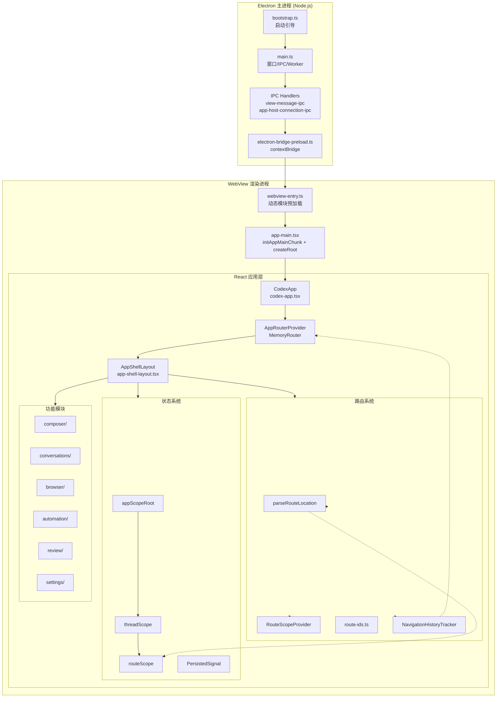

# 架构总览 — Codex 逆向工程分析

> 本文档基于 `decode-codex` 项目逆向还原的源码，描述 Codex 桌面应用的完整架构分层、模块间关系与数据流。

---

## 1. 整体架构分层

Codex 桌面应用基于 **Electron** 框架构建，采用经典的多进程架构，分为三层：

```
┌─────────────────────────────────────────────────────────────────┐
│                     Electron 主进程 (Node.js)                     │
│  src/main/                                                       │
│  bootstrap.ts → main.ts → 窗口管理、IPC、更新、托盘、协议处理等     │
└──────────────────────────┬──────────────────────────────────────┘
                           │  IPC (contextBridge + MessagePort)
                           │  preload 脚本: electron-bridge-preload.ts
                           ▼
┌──────────────────────────────────────────────────────────────────┐
│             WebView 渲染进程 (Chromium, contextIsolation)          │
│  raw-app-asar-unpacked/webview/index.html                         │
│       │                                                          │
│       │  webview-entry.ts 引导加载                                 │
│       │  → preloadDynamicImport 预加载分块                          │
│       ▼                                                          │
│  React 应用层 (createRoot → <CodexApp />)                        │
│  ┌─────────────────────────────────────────────────────────┐     │
│  │  App Shell 层 (app-shell/)                               │     │
│  │  CodexApp → AppRouterProvider → MemoryRouter              │     │
│  │  AppShellLayout (左右面板 + 底栏 + 主内容区)               │     │
│  ├─────────────────────────────────────────────────────────┤     │
│  │  Runtime / 基础设施层 (runtime/, boundaries/)             │     │
│  │  路由系统、信号系统、Scope 系统、PersistedSignal            │     │
│  ├─────────────────────────────────────────────────────────┤     │
│  │  功能模块层 (composer/, conversations/, automation/,       │     │
│  │  browser/, review/, settings/, ...)                       │     │
│  └─────────────────────────────────────────────────────────┘     │
└──────────────────────────────────────────────────────────────────┘
```

### 1.1 Electron 主进程 (`src/main/`)

主进程入口是 src/main/bootstrap.ts，负责：

- **启动引导**: 单实例锁、DMG 安装流程（macOS）、Chromium 开关配置
- **协议注册**: `app://` 协议处理器（`registerAppProtocolHandler`）
- **窗口创建**: `BasicMainWindowServices.createFreshWindow()` → `new BrowserWindow({...})` → 加载 `app://webview/index.html`
- **IPC 注册**: 系统主题同步、原生菜单、App Host 连接、Sentry、Worker RPC 等
- **Worker 管理**: `MainWorkerBusController` 管理后台 worker 进程
- **后台服务**: 更新器 (Sparkle)、托盘 (Tray)、Chronicle sidecar、Computer Use、Automation Scheduler

主进程核心文件：

| 文件 | 职责 |
|------|------|
| src/main/bootstrap.ts | 启动引导：单实例锁、DMG安装、协议注册、窗口创建 |
| src/main/main.ts | 应用生命周期、窗口服务、IPC注册、Worker 总线 |
| src/main/ipc/ | IPC 处理器目录 (view-message-ipc, app-host-connection-ipc, preload-state-ipc 等) |
| src/main/preload/electron-bridge-preload.ts | preload 脚本，向渲染进程暴露有限 API |

### 1.2 Preload 层

Electron `contextIsolation: true` 模式下，preload 脚本通过 `contextBridge` 向渲染进程暴露安全的 IPC 通道。渲染进程通过 `window.__electronBridge` 或 facade 层调用主进程能力。

### 1.3 WebView 渲染进程

渲染进程加载 `index.html`，入口流程为：

```
webview-entry.ts
  → bootstrapCodexWebview()
    → installModulepreloadPolyfill()
    → preloadDynamicImport() 加载 RPC + app-main 分块
    → app-main.tsx
      → initAppMainChunk()
        → 初始化所有 runtime chunk (error-boundary, logging, feature, etc.)
        → createRoot(document.getElementById("root"))
        → render(<React.StrictMode><ErrorBoundary><CodexApp /></ErrorBoundary></React.StrictMode>)
```

关键文件：

| 文件 | 职责 |
|------|------|
| src/app-shell/webview-entry.ts | WebView JS 入口，预加载清单驱动动态导入 |
| src/app-shell/app-main.tsx | React 根渲染入口，初始化所有运行时 chunk |
| src/runtime/app-main-runtime.ts | 语义化导出绑定，聚合各种 runtime chunk |

---

## 2. CodexApp 根组件与 Xne 层级

### 2.1 CodexApp 组件

`CodexApp`（src/app-shell/codex-app.tsx）是整个渲染进程 React 组件树的根节点：

```tsx
export function CodexApp({ children }: CodexAppProps = {}) {
  React.useEffect(() => {
    vscodeBridge.dispatchMessage("log-message", {...});
    vscodeBridge.dispatchMessage("ready", {});
  }, []);

  return (
    <AppRouterProvider>
      {children ?? (
        <main className="..." data-codex-app-root="">
          <AppPreloader debugName="CodexApp" />
        </main>
      )}
    </AppRouterProvider>
  );
}
```

### 2.2 Xne 层级

从恢复的构建产物注释可知，原始 bundle 的组件层级为 `CodexApp → Xne → HM → MemoryRouter`。其中：

- **`Xne`** 是构建工具 (rolldown) 对 React 的混淆标识符（极可能是 `React.Fragment` 或某个内部包装组件）
- **`HM`** 大概率是构建工具重命名后的 React.createElement 或 Fragment 包装
- 在恢复源码中，`AppRouterProvider` 直接渲染 `AppMemoryRouter`（即 `<MemoryRouter>`），简化了这一层级

原始层级：`CodexApp → Xne(React.Fragment) → HM → MemoryRouter → ...`

恢复层级：`CodexApp → AppRouterProvider → AppMemoryRouter(MemoryRouter) → ...`

---

## 3. AppRouterProvider / MemoryRouter

### 3.1 AppRouterProvider

src/app-shell/app-router-provider.tsx 是路由包装器：

```tsx
export function AppRouterProvider({ children }: AppRouterProviderProps) {
  return <AppMemoryRouter>{children}</AppMemoryRouter>;
}
```

### 3.2 AppMemoryRouter

使用 `react-router` 的 `MemoryRouter`（src/vendor/react-router.ts 对 npm 包 `react-router` 的简单 re-export）：

- `MemoryRouter` 维护内存中的历史栈，因为 Electron 渲染进程没有真实 URL 栏
- `unstable_useTransitions: false` — 路由变更同步应用，不包装在 React transition 中
- 不声明 `<Routes>` / `<Route>` 表格 — 路由不是通过声明式路由表匹配的，而是通过 `parseRouteLocation` 从路径字符串解析

### 3.3 设计动机

桌面应用不需要浏览器 URL 同步，因此：

1. 使用 `MemoryRouter` 而非 `BrowserRouter` / `HashRouter`
2. 应用自身信号系统（`parseRouteLocation` 返回的 `RouteLocation`）驱动页面渲染
3. `react-router` 主要用于提供 `useNavigate` / `useLocation` / `useParams` 等 hooks，便于代码组织

---

## 4. 运行时初始化链

### 4.1 初始化流程

```
Electron app.whenReady()
  → bootstrap.ts: runMainAppStartup()
    → BasicMainWindowServices.ensureWindow()
      → new BrowserWindow({ preload, ... })
      → window.loadURL(app://webview/index.html)
        → webview-entry.ts
          → bootstrapCodexWebview()
            → preloadDynamicImport() 加载依赖分块
            → app-main.tsx: initAppMainChunk()
              → 顺序调用所有 init*Chunk() 函数
              → createRoot → render(<CodexApp />)
```

### 4.2 Runtime Chunk 初始化

`initAppMainChunk()`（src/app-shell/app-main.tsx）按依赖顺序初始化：

```
 1. initRegisterAppActionsChunk()         // 应用 action 注册
 2. initErrorBoundaryRuntimeChunk()        // 错误边界
 3. initAppFallbackChunk()                // 应用 fallback UI
 4. initAppFeatureRuntimeChunk()          // 特性开关
 5. initPublicationTermsHandlerRegistry() // 发布条款处理
 6. initAutomationsRuntimeChunk()         // 自动化 runtime
 7. initAppRuntimeChunk()                 // 主 runtime
 8. initAutomationsStateChunk()           // 自动化状态
 9. initAppHostServicesRuntimeChunk()     // 主机服务
10. initRendererSentryRuntimeChunk()     // Sentry 监控
11. initCodexAppChunk()                  // CodexApp 自身
12. initAppLoggingChunk()                // 日志系统
13. initEmptyAppChunk()                  // 空初始化
14. initializeRendererSentry()           // Sentry 初始化
15. installGlobalErrorForwarders()       // 全局错误转发
16. createRoot + render                   // React 挂载
```

### 4.3 app-shared-runtime.ts

src/app-shared-runtime.ts 目前是空桶（已退役的兼容层），其导出已迁移到各语义模块中。

---

## 5. App Shell 布局系统

### 5.1 插槽架构 (Slot System)

src/app-shell/app-shell-slots/ 定义了声明式插槽组件：

- `AppShellRoot` — 解析子组件，提取 `LeftPanel` / `RightPanel` / `BottomPanel` 插槽
- `AppShellLayout` — 实际布局引擎，组合 Motion 动画、面板宽度、ResizeHandle
- `AppShellLeftPanelSlot` / `AppShellRightPanelSlot` / `AppShellBottomPanelSlot` — 标记插槽

### 5.2 AppShell 命名空间

src/app-shell/app-shell/index.tsx 将所有插槽组件聚合为单一命名空间 `AppShell.*`：

```
AppShell.Root
AppShell.LeftPanel
AppShell.Content
AppShell.Header / .HeaderAction / .HeaderContextMenuItem
AppShell.RightPanel / .RightPanelTabs / .RightPanelOutlet
AppShell.BottomPanel / .BottomPanelTabs / .BottomPanelOutlet
AppShell.MainContentLayout
```

### 5.3 布局数据流

`AppShellLayout` 使用 Framer Motion 的 `MotionValue` 管理：

- **左侧栏**: `leftPanelWidth` → `sidebarOpenAnimationSignal` → 动画展开/收起
- **右侧栏**: `rightPanelWidth` / `rightPanelWidthRatio` / `rightPanelMaximizedSignal`
- **底栏**: `bottomPanelHeight` → `clampedBottomPanelHeight` → `bottomPanelHeightRatio`
- **主内容区**: `mainContentWidth` / `mainContentTargetWidth` / `mainContentLayoutSignal`

---

## 6. 状态管理系统

### 6.1 Scope 信号系统

src/boundaries/app-scope.tsx 实现了基于 Scope 的反应式状态管理：

- **`appScopeRoot`** — 根作用域
- **`threadScope`** — 线程作用域，以 `clientThreadId` 为 key，最大保留 20 个
- **`routeScope`** — 路由作用域，以 `pathname + search` 为 key，parent 为 threadScope
- **`createAppScopeSignal`** — 创建作用域信号
- **`createScopedAtom`** — 创建带键的作用域 atom（类似 jotai atom family）
- **`createDerivedScopedAtom`** — 派生 atom

Scope 层级关系：

```
appScopeRoot (全局)
  └── threadScope (以 clientThreadId 为 key)
       └── routeScope (以 pathname + search 为 key)
```

### 6.2 PersistedSignal 持久化信号

src/runtime/persisted-signal/signals.ts：

- `createPersistedSignal(key, initialValue)` — 创建持久化信号，注册到 `persistedSignalInitialValueMap`
- `createPersistedAtomSignal(storageKeyForScopeKey, defaultValue)` — 创建与外部存储（`persisted-atom-store`）双向同步的信号
- `dynamicSignalResolver` — 动态信号解析器

### 6.3 signal vs atom

系统混合使用两种反应式原语：

| 类型 | 创建方式 | 用途 |
|------|---------|------|
| Scope Signal | `createAppScopeSignal(scope, initialValue)` | 全局/作用域级别的状态 |
| Scoped Atom | `createScopedAtom(scope, factory)` | 键参数化的状态（类似 jotai atomFamily） |
| PersistedSignal | `createPersistedSignal(key, value)` | 需持久化或动态解析的信号 |
| PersistedAtomSignal | `createPersistedAtomSignal(...)` | 与外部存储双向同步的信号 |

---

## 7. 各层关系与数据流

### 7.1 页面渲染数据流

```
MemoryRouter (路径变更)
  → useLocation() 获取当前 pathname
  → parseRouteLocation({ pathname, search, routeTemplate })
    → 返回 RouteLocation（带 routeKind 区分联合）
  → RouteScopeProvider 提供 routeScope + threadScope
  → 功能页面根据 routeKind 渲染对应 UI
```

### 7.2 导航数据流

```
用户操作 → useNavigate() / dispatchMessage("navigate-to-route")
  → MemoryRouter 入栈新路径
  → NavigationHistoryTracker 追踪历史
  → canNavigateBackSignal / canNavigateForwardSignal 更新
  → 后退/前进按钮状态更新
```

### 7.3 IPC 数据流

```
渲染进程
  → facade 层 (src/boundaries/rpc.facade.ts)
    → contextBridge 暴露的 IPC 通道
      → Electron IPC (ipcRenderer → ipcMain)
        → 主进程处理器
```

### 7.4 模块间依赖

```
app-shell/ (UI 框架层)
  ├── runtime/ (基础设施层)
  │   ├── persisted-signal/ (路由 + 信号系统)
  │   ├── error-boundary/ (错误边界)
  │   └── query-client/ (数据查询)
  ├── boundaries/ (边界/Facade 层)
  ├── features/ (特性开关)
  ├── composer/ (Composer 模块)
  ├── conversations/ (对话模块)
  ├── automations/ (自动化模块)
  ├── browser/ (浏览器模块)
  ├── review/ (代码审查模块)
  └── ... (功能模块)
```

---

## 8. 架构图



---

## 9. 抽象与设计模式

| 模式 | 实现 | 说明 |
|------|------|------|
| **MemoryRouter 路由** | react-router MemoryRouter | Electron 无 URL 栏，历史栈在内存中 |
| **信号驱动路由** | parseRouteLocation → RouteLocation 区分联合 | 无声明式 Routes 表，由信号触发页面渲染 |
| **Scope 模式** | appScopeRoot → threadScope → routeScope | 层级化状态隔离，自动回收 |
| **插槽组合** | AppShell.Root + LeftPanel + Content + RightPanel + BottomPanel | 声明式面板布局 |
| **Facade 模式** | src/boundaries/ 各 facade 文件 | 隔离渲染进程与主进程/外部依赖 |
| **Chunk 初始化** | init*Chunk() 函数 | 显式按序初始化模块，与构建分块对应 |
| **Motion 动画** | Framer Motion MotionValue | 面板动画，减少不必要的重渲染 |
| **持久化信号** | PersistedSignal / PersistedAtomSignal | 与外部存储同步的反应式状态 |

---

## 10. 关键路径总结

```
启动: bootstrap → main → createWindow → loadURL → webview-entry → preload → app-main → initChunks → CodexApp
页面渲染: MemoryRouter → parseRouteLocation → RouteLocation → RouteScopeProvider → 功能页面
状态管理: createAppScopeSignal / createScopedAtom → scope.get/set → 响应式更新
导航: dispatchMessage("navigate-to-route") / useNavigate → MemoryRouter 入栈 → NavigationHistoryTracker
持久化: createPersistedSignal → registerPersistedSignalInitialValue → subscriber 通知
```
