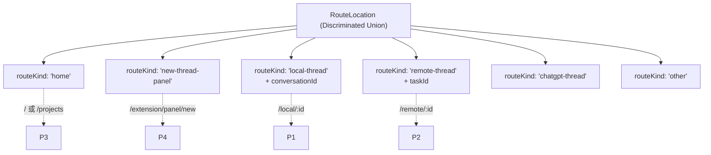
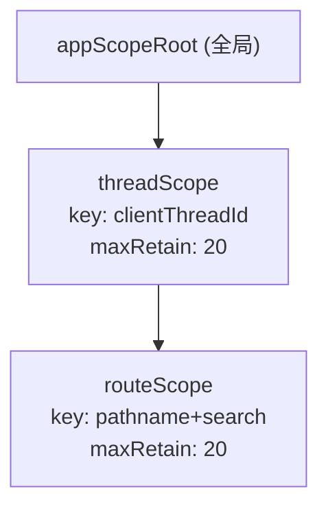
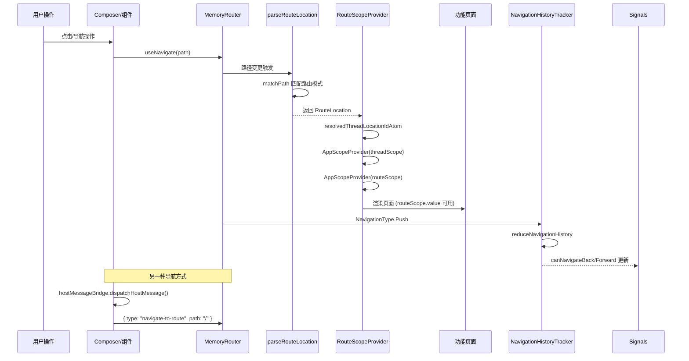
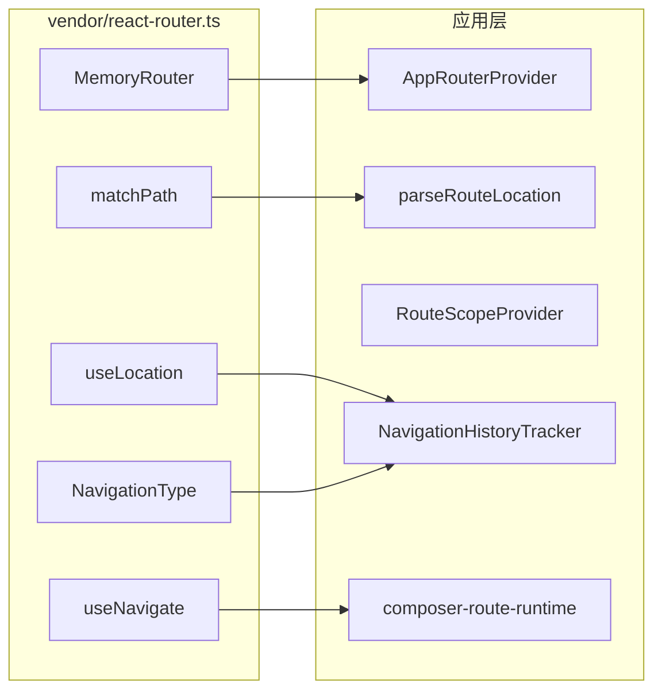

# 路由系统 — Codex 逆向工程分析

> 本文档基于 `decode-codex` 项目逆向还原的源码，在 notes/restored-routing.md 基础上扩展，
> 详细描述 Codex 桌面应用在 Electron 渲染进程中的路由架构、解析机制与导航实现。

---

## 1. 设计背景

Codex 桌面应用基于 Electron，渲染进程运行在 Chromium WebView 中，**没有真实浏览器地址栏**。
因此路由系统不依赖 URL，而是构建于：

1. **react-router 的 `MemoryRouter`** — 在内存中维护历史栈
2. **应用自身的信号系统** — `parseRouteLocation` 将路径解析为 `RouteLocation` 辨析联合类型
3. **Scope 系统** — 通过 `routeScope` / `threadScope` 提供作用域隔离

关键设计决策：**没有声明式的 `<Routes><Route path=… element=…>` 表格**。
路由是通过核心解析函数 `parseRouteLocation` 将路径字符串匹配为 `RouteLocation`，
再根据 `routeKind` 字段由各功能模块自行决定渲染内容。

---

## 2. MemoryRouter 配置与使用

### 2.1 AppRouterProvider

[src/app-shell/app-router-provider.tsx](/O%3A/work_space/github.com/@zhzluke96/decode-codex/src/app-shell/app-router-provider.tsx)

```tsx
export function AppRouterProvider({ children }: AppRouterProviderProps) {
  return <AppMemoryRouter>{children}</AppMemoryRouter>;
}
```

### 2.2 AppMemoryRouter

```tsx
export function AppMemoryRouter({ children, initialEntries }: AppMemoryRouterProps) {
  return (
    <MemoryRouter
      initialEntries={initialEntries}
      {...({ unstable_useTransitions: false } as {
        unstable_useTransitions: boolean;
      })}
    >
      {children}
    </MemoryRouter>
  );
}
```

- **`initialEntries`**: 可选的初始历史条目。省略时 react-router 从 `"/"` 开始
- **`unstable_useTransitions: false`**: 路由变更同步应用，不包装在 React transition 中

### 2.3 在 CodexApp 中的位置

[src/app-shell/codex-app.tsx](/O%3A/work_space/github.com/@zhzluke96/decode-codex/src/app-shell/codex-app.tsx) 将 `AppRouterProvider` 作为根包装器：

```tsx
export function CodexApp({ children }: CodexAppProps = {}) {
  return (
    <AppRouterProvider>
      {children ?? <main><AppPreloader /></main>}
    </AppRouterProvider>
  );
}
```

完整挂载层级：`CodexApp → AppRouterProvider → AppMemoryRouter(MemoryRouter)`

---

## 3. 路由解析核心：parseRouteLocation

### 3.1 函数签名

[src/runtime/persisted-signal/routes.ts](/O%3A/work_space/github.com/@zhzluke96/decode-codex/src/runtime/persisted-signal/routes.ts)

```ts
export function parseRouteLocation({
  pathname,
  routeTemplate,
  search = "",
}: ParseRouteLocationInput): RouteLocation
```

### 3.2 匹配顺序与路由模式

解析器按优先级依次匹配以下模式：

| 优先级 | 匹配条件 | 路由类型 | 匹配实现 |
|--------|---------|---------|---------|
| 1 | `/local/:conversationId` | `"local-thread"` | `matchPath` |
| 2 | `/hotkey-window/thread/:conversationId` | `"local-thread"` | `matchPath` |
| 3 | `/remote/:taskId` | `"remote-thread"` | `matchPath` |
| 4 | `/hotkey-window/remote/:taskId` | `"remote-thread"` | `matchPath` |
| 5 | `/projects?projectId=...` | `"home"` (带项目上下文) | 字符串比较 + URLSearchParams |
| 6 | `/` 或 `/hotkey-window` | `"home"` | 字符串比较 |
| 7 | `/extension/panel/new` 或 `/hotkey-window/new-thread` | `"new-thread-panel"` | 字符串比较 |
| 8 | 以上均不匹配 | `"other"` | 兜底 |

### 3.3 项目上下文解析

```ts
function parseProjectRouteContext(search: string): ProjectRouteContext | null {
  const searchParams = new URLSearchParams(search);
  const projectId = searchParams.get("projectId");
  return projectId == null ? null : {
    hostId: searchParams.get("hostId"),
    projectId,
  };
}
```

---

## 4. RouteLocation 类型系统

### 4.1 类型定义

[src/runtime/persisted-signal/types.ts](/O%3A/work_space/github.com/@zhzluke96/decode-codex/src/runtime/persisted-signal/types.ts)

```ts
export type BaseRouteLocation = {
  pathname: string;
  routeTemplate: string;
  search: string;
};

export type HomeRouteLocation = BaseRouteLocation & {
  routeKind: "home";
  projectContext: ProjectRouteContext | null;
};

export type NewThreadPanelRouteLocation = BaseRouteLocation & {
  routeKind: "new-thread-panel";
};

export type LocalThreadRouteLocation = BaseRouteLocation & {
  routeKind: "local-thread";
  conversationId: string;
  projectContext: ProjectRouteContext | null;
};

export type RemoteThreadRouteLocation = BaseRouteLocation & {
  routeKind: "remote-thread";
  taskId: string;
};

export type ChatGptThreadRouteLocation = BaseRouteLocation & {
  routeKind: "chatgpt-thread";
  conversationId: string;
};

export type OtherRouteLocation = BaseRouteLocation & {
  routeKind: "other";
};

export type RouteLocation =
  | HomeRouteLocation
  | NewThreadPanelRouteLocation
  | LocalThreadRouteLocation
  | RemoteThreadRouteLocation
  | ChatGptThreadRouteLocation
  | OtherRouteLocation;
```

### 4.2 辅助类型

```ts
export type ProjectRouteContext = { hostId: string | null; projectId: string };
export type ParseRouteLocationInput = { pathname: string; routeTemplate: string; search?: string };
export type ThreadRouteScopeValue = { clientThreadId: string } & RouteLocation;
export type DraftThreadEntrypoint = "home" | "panel";
```

### 4.3 路由类型图解



---

## 5. 路由 ID 编码

### 5.1 ID 编码函数

[src/runtime/persisted-signal/route-ids.ts](/O%3A/work_space/github.com/@zhzluke96/decode-codex/src/runtime/persisted-signal/route-ids.ts)

| 函数 | 输出格式 | 输入 |
|------|---------|------|
| `toLocalThreadLocationId(id)` | `"local:{id}"` | 本地会话 ID |
| `toRemoteThreadLocationId(id)` | `"remote:{id}"` | 远程任务 ID |
| `toRouteThreadLocationId(key)` | `"route:{key}"` | 通用路由键 |
| `getDraftThreadLocationIdForEntrypoint(ep)` | `"new-conversation"` 或 `"panel-new-conversation"` | 草稿入口 |
| `createClientThreadId()` | `"client-new-thread:{uuid}"` | 新客户端线程 |

### 5.2 常量定义

```ts
const HOME_DRAFT_THREAD_LOCATION_ID = "new-conversation";
const PANEL_DRAFT_THREAD_LOCATION_ID = "panel-new-conversation";
const CLIENT_THREAD_ID_PREFIX = "client-new-thread:";
const LOCAL_THREAD_LOCATION_PREFIX = "local:";
const REMOTE_THREAD_LOCATION_PREFIX = "remote:";
const ROUTE_THREAD_LOCATION_PREFIX = "route:";
```

### 5.3 辅助函数

- `isDraftThreadLocationId(id)`: 判断是否为草稿位置 ID
- `isClientThreadId(threadId)`: 判断是否为客户端线程 ID（以 `"client-new-thread:"` 开头）
- `normalizeConversationId(id)`: 规范化会话 ID（当前为恒等函数）

---

## 6. 各功能模块的路由定义

### 6.1 路由文件分布

项目中路由相关文件广泛分布在各功能模块中：

| 模块 | 文件 | 用途 |
|------|------|------|
| **composer** | composer-route-runtime.ts | 路径构建器：conversationRoutePath、openThreadPath、openTaskPath、toHotkeyWindowPath |
| **conversations** | local-thread-route.ts | 本地线程路由值提取 |
| **conversations** | current-route-signal.ts | 当前路由信号 handle |
| **conversations** | local-conversation-route-runtime.ts | 会话路由运行时 |
| **conversations** | local-conversation-page-parts/route.tsx | 会话页面路由组件 |
| **conversations** | local-conversation-thread-parts/local-conversation-thread-route.tsx | 线程路由组件 |
| **conversations** | use-conversation-id-from-route.ts | 从路由提取会话 ID |
| **appgen** | project-site-routes.ts | AppGen 站点路由 |
| **appgen** | publication-terms/route.tsx | 发布条款路由 |
| **automation** | automation-route-runtime.ts | 自动化路由 |
| **browser** | browser-route-side-panel-stubs.ts | 浏览器侧栏路由 |
| **browser** | browser-tab-route-sync.ts | 浏览器标签路由同步 |
| **browser** | browser-tab-state-runtime/route-state.ts | 标签路由状态 |
| **review** | review-route-runtime.ts | 审查路由 |
| **settings** | local-environment-create-route.ts | 本地环境创建 |
| **settings** | hooks-settings-route.ts | Hooks 设置 |
| **settings** | settings-navigation/active-settings-route.ts | 活跃设置 |
| **settings** | settings-navigation/settings-return-route.ts | 设置返回 |
| **routes** | login-route.tsx | 登录页面 |
| **routes** | open-home-route.ts | 打开主页（含预填状态） |
| **routes** | first-run.tsx | 首次运行页 |
| **sites** | routes.ts | 站点路由 |
| **sidebar** | sites-route-nav-link.tsx | 侧栏站点导航链接 |

### 6.2 Composer 路由构建器

[src/composer/composer-route-runtime.ts](/O%3A/work_space/github.com/@zhzluke96/decode-codex/src/composer/composer-route-runtime.ts) 提供标准路径构建函数：

- **`conversationRoutePath(threadId)`** → `/local/{encodeURIComponent(threadId)}`
- **`openTaskPath(taskId)`** → `/remote/{encodeURIComponent(taskId)}`
- **`pendingWorktreeInitPath(id)`** → `/worktree-init-v2/{id}`
- **`toHotkeyWindowPath(path)`** — 普通路径 → 热键窗口路径
- **`openHotkeyWindowThread({path})`** — 通过 hotkey bridge 导航

### 6.3 构建与解析映射

```
构建: conversationRoutePath(id) → "/local/{id}"
解析: parseRouteLocation → matchPath("/local/:conversationId")
  → { routeKind: "local-thread", conversationId }

构建: openTaskPath(taskId) → "/remote/{taskId}"
解析: parseRouteLocation → matchPath("/remote/:taskId")
  → { routeKind: "remote-thread", taskId }

构建: openHomeRoute() → hostMessageBridge({ path: "/" })
解析: parseRouteLocation → pathname === "/"
  → { routeKind: "home" }
```

---

## 7. 路由作用域 (RouteScopeProvider)

### 7.1 组件实现

[src/runtime/route-scope-provider.tsx](/O%3A/work_space/github.com/@zhzluke96/decode-codex/src/runtime/route-scope-provider.tsx)

```tsx
export function RouteScopeProvider({ children, route }: RouteScopeProviderProps) {
  const clientThreadId = appScopeA(resolvedThreadLocationIdAtom, route) as string;
  const threadScopeValue = useMemo<ThreadRouteScopeValue>(
    () => ({ clientThreadId }), [clientThreadId],
  );
  const routeLayer = (
    <AppScopeProvider scope={routeScope} value={route}>
      {children}
    </AppScopeProvider>
  );
  return (
    <AppScopeProvider scope={threadScope} value={threadScopeValue}>
      {routeLayer}
    </AppScopeProvider>
  );
}
```

### 7.2 Scope 层级



### 7.3 导入状态跟踪

```ts
export const routeScopeImportStatusSignal = createAppScopeSignal(appScopeRoot, {
  status: "idle" // → "importing" → "success" | "error"
} satisfies RouteScopeImportStatus);
```

---

## 8. 初始路由

### 8.1 initial-route-atom

[src/utils/initial-route-atom.ts](/O%3A/work_space/github.com/@zhzluke96/decode-codex/src/utils/initial-route-atom.ts)

从两个来源读取初始路由：

1. **Meta 标签**: `<meta name="initial-route" content="...">`
2. **URL 查询参数**: `?initialRoute=...`

```ts
function readInitialRoute(): string | null {
  const meta = document.querySelector('meta[name="initial-route"]');
  if (meta?.content?.trim()) return meta.content.trim();
  const param = new URL(window.location.href).searchParams.get("initialRoute");
  return param ? param.trim() : null;
}
export const initialRouteAtom = readInitialRoute();
```

在 Electron 主进程中，`createFreshWindow(initialRoute)` 将初始路由编码为 URL 参数。

---

## 9. Vendor 层 react-router shim

### 9.1 适配层

[src/vendor/react-router.ts](/O%3A/work_space/github.com/@zhzluke96/decode-codex/src/vendor/react-router.ts)

对 npm 包 `react-router`（^8.1.0）的简单再导出：

```ts
export {
  Link, MemoryRouter, Navigate, NavigationType,
  Route, Routes, UNSAFE_LocationContext,
  createRoutesFromChildren, matchRoutes, matchPath,
  useLocation, useMatch, useNavigate, useNavigationType,
  useOutlet, useParams, useSearchParams,
} from "react-router";
```

---

## 10. 导航历史

### 10.1 NavigationHistoryTracker

[src/app-shell/navigation-history-tracker.tsx](/O%3A/work_space/github.com/@zhzluke96/decode-codex/src/app-shell/navigation-history-tracker.tsx)

纯副作用组件，不渲染 UI，追踪 MemoryRouter 历史栈：

```tsx
export function NavigationHistoryTracker(): null {
  const scope = useAppScopeStore();
  const location = useLocation();
  const navigationType = useNavigationType();
  const historyRef = React.useRef<NavigationHistoryState>({
    entries: [location.key], index: 0,
  });
  const nextState = reduceNavigationHistory(
    historyRef.current, location.key, navigationType,
  );
  historyRef.current = nextState;
  React.useLayoutEffect(() => {
    scope.set(canNavigateBackSignal, nextState.index > 0);
    scope.set(canNavigateForwardSignal, nextState.index < nextState.entries.length - 1);
  }, [nextState, scope]);
  return null;
}
```

### 10.2 历史栈缩减

```ts
export function reduceNavigationHistory(
  state: NavigationHistoryState, locationKey: string, navigationType: NavigationType,
): NavigationHistoryState {
  if (state.entries[state.index] === locationKey) return state;
  if (navigationType === NavigationType.Push) {
    const entries = state.entries.slice(0, state.index + 1);
    entries.push(locationKey);
    return { entries, index: entries.length - 1 };
  }
  if (navigationType === NavigationType.Replace) {
    const entries = state.entries.slice();
    entries[state.index] = locationKey;
    return { entries, index: state.index };
  }
  if (navigationType === NavigationType.Pop) {
    const existingIndex = state.entries.indexOf(locationKey);
    if (existingIndex !== -1) return { entries: state.entries, index: existingIndex };
    const entries = state.entries.slice(0, state.index + 1);
    entries.push(locationKey);
    return { entries, index: entries.length - 1 };
  }
  throw Error("Unhandled navigation type");
}
```

### 10.3 信号

[src/app-shell/navigation-history-signals.ts](/O%3A/work_space/github.com/@zhzluke96/decode-codex/src/app-shell/navigation-history-signals.ts)

```ts
export const canNavigateBackSignal = createScopedAtom(appStoreScope, false);
export const canNavigateForwardSignal = createScopedAtom(appStoreScope, false);
```

### 10.4 侧栏导航

[src/app-shell/sidebar-navigation-signals.ts](/O%3A/work_space/github.com/@zhzluke96/decode-codex/src/app-shell/sidebar-navigation-signals.ts)

```ts
export const canNavigateSidebarBackSignal = createAppScopeSignal(appScopeRoot, false);
export const canNavigateSidebarForwardSignal = createAppScopeSignal(appScopeRoot, false);
```

---

## 11. 路由数据流完整图解



---

## 12. 路由系统的关键抽象

| 抽象 | 实现 | 设计意图 |
|------|------|---------|
| **MemoryRouter 封装** | AppRouterProvider + AppMemoryRouter | 统一路由容器，适配 Electron 环境 |
| **信号驱动路由** | parseRouteLocation → RouteLocation | 无声明式路由表，信号驱动渲染 |
| **辨析联合类型** | RouteLocation (routeKind) | 编译期类型安全，穷举检查 |
| **Scope 隔离** | RouteScopeProvider (thread + route) | 每路由/每线程独立状态沙箱 |
| **ID 编码** | toLocalThreadLocationId 等 | 位置 ID 统一规范化 |
| **历史追踪** | NavigationHistoryTracker | 独立增量式历史管理 |
| **双路径导航** | useNavigate + hostMessageBridge | 组件内 vs 主进程指令导航 |

---

## 13. 与 vendor react-router 的关系



`react-router` 仅提供低级原语（MemoryRouter 容器 + hooks），真实路由逻辑全在应用层实现。

---

## 14. 总结

Codex 路由系统体现**去声明式、重信号驱动**的设计哲学：

1. **MemoryRouter 仅作容器和 hook API** — 真正的路由解析在应用层
2. **parseRouteLocation 是纯函数** — 输入 pathname + search，输出类型安全的 RouteLocation
3. **Scope 系统深度集成** — 路由状态与线程状态绑定，自动回收
4. **历史追踪独立** — NavigationHistoryTracker 增量管理，不依赖 react-router 的 history 实现
5. **模块自治** — 各功能模块自行定义路由构建/解析，以 composer-route-runtime.ts 为通用模式
