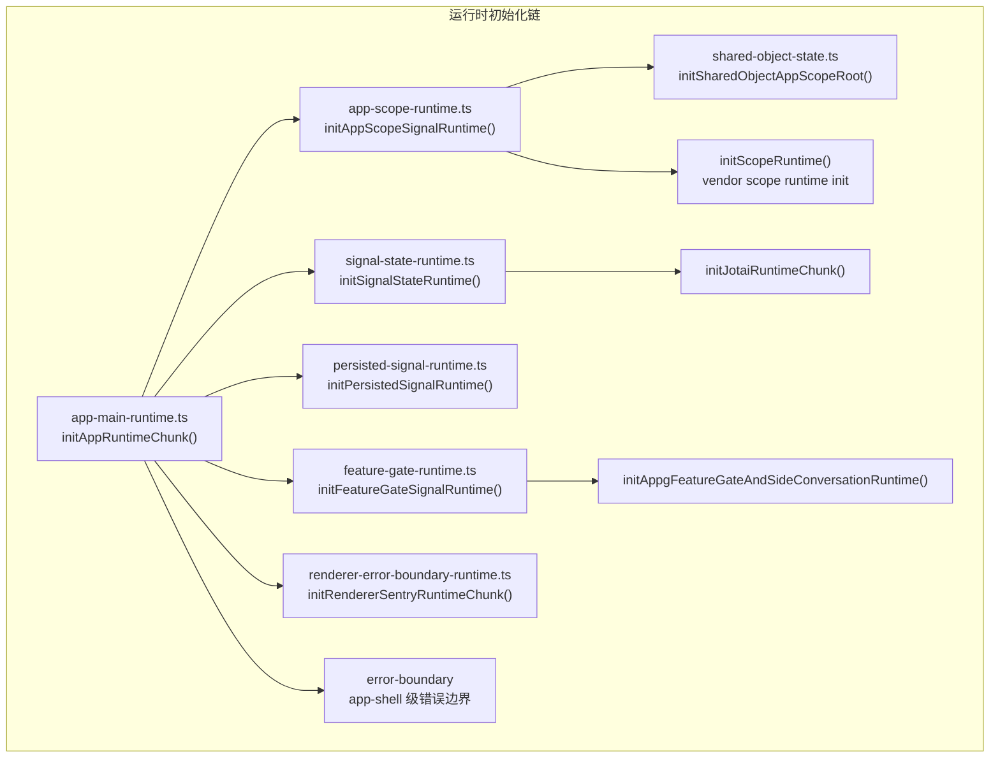
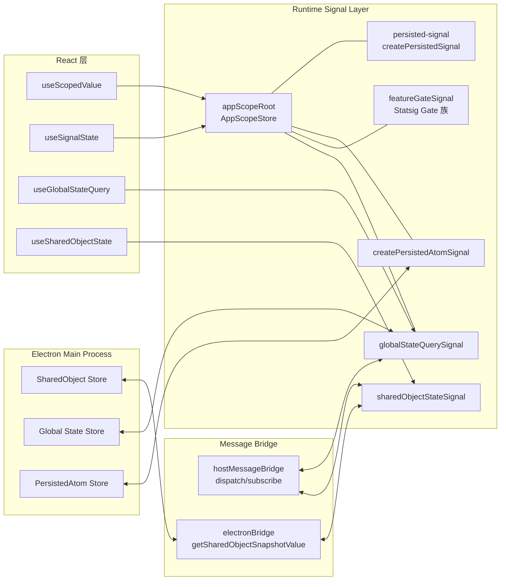

# 03 - Runtime Signal System

> Card ID: `72f136d1`
> 分析 Codex 运行时信号系统，涵盖 persisted-signal、app-scope、app-main-runtime 及其状态管理抽象。

---

## 1. 系统概述

Codex 的运行时层是一套建立在 **Scoped Signal** 上的状态管理架构。核心思路：

- 信号（Signal）是状态的最小单元，支持作用域（Scope）隔离
- 持久化信号（Persisted Signal）自动在 React 状态与 Electron 主进程存储间同步
- App-Scope 提供根作用域和信号工厂，所有业务模块通过它读写状态
- 运行时初始化采用 **chunk producer** 模式：vendor 原始 chunk → deobfuscate → restored runtime

---

## 2. App-Scope 系统

### 2.1 核心架构

App-Scope 系统位于 `src/boundaries/app-scope.tsx`，提供一套轻量级信号运行时。

**关键文件：**
- `O:\work_space\github.com\@zhzluke96\decode-codex\src\boundaries\app-scope.tsx`
- `O:\work_space\github.com\@zhzluke96\decode-codex\src\runtime\app-scope-runtime.ts`
- `O:\work_space\github.com\@zhzluke96\decode-codex\src\runtime\app-scope-hooks.ts`
- `O:\work_space\github.com\@zhzluke96\decode-codex\src\shared-object-host-runtime\shared-object-state.ts`

### 2.2 AppScopeStore

`AppScopeStore` 是核心存储类，内部维护 `Map<string, unknown>` 保存所有信号值：

```
class AppScopeStore {
  private readonly values = new Map<string, unknown>();
  get<T>(signal, key?): T
  set(signal, keyOrUpdater, value?)
  watch(callback): () => void
  query: { snapshot, setData }
}
```

- **get**: 先检查 `signal.read`（派生信号），再查存储 Map，最后 fallback 到 `defaultValue`
- **set**: 支持直接值和 updater 函数 `(current) => next`
- **signalKey**: `id` 或 `id:JSON.stringify(key)` 作为 Map key

### 2.3 信号工厂

| 函数 | 等价名 | 功能 |
|------|--------|------|
| `createAppScopeSignal` | `appScopeG` | 创建根作用域信号，id 自增 |
| `createAppScopedSignal` | -- | 包装 `createScopedSignalRaw` 绑定 appScopeRoot |
| `appScopeL` | `createDerivedScopedAtom` | 派生信号：传 `read(key, store) => value` |
| `appScopeC` | `_appScopeC` | 计算信号：传 `read(store) => value` |
| `appScopeM` | `_appScopeM` | 查询信号族：传 `queryFactory(...args) => value` |
| `appScopeH` | `createScopedScope` | 创建子作用域 `new AppScopeStore({ name, value })` |
| `appScopeU` | `createScopedResolver` | 创建解析器 |
| `appScopeV` | `createSignalFamily` | 创建带缓存的信号族 |
| `appScopeUnderscore` | `createScopedAtom` | 创建有默认值的 ScopedAtom |

### 2.4 作用域层级

```
appScopeRoot (全局单例 AppScopeStore)
  └── threadScope (ThreadScope, key by clientThreadId, max 20)
       └── routeScope (RouteScope, key by pathname+search, max 20)
```

定义于 `persisted-signal/signals.ts`:

```typescript
export const threadScope = createScopedScope("ThreadScope", {
  key: (value) => value.clientThreadId,
  parent: appScopeRoot,
  retain: { max: 20 },
});

export const routeScope = createScopedScope("RouteScope", {
  key: ({ pathname, search }) => `${pathname}${search ?? ""}`,
  parent: threadScope,
  retain: { max: 20 },
});
```

### 2.5 React 集成

通过 `app-scope-hooks.ts` 提供的 hooks 将信号桥接到 React：

```typescript
// 提供作用域上下文
ScopeValueProvider -> scope={someScope} value={value}

// 读取当前 scope
useScope<T>(scope): T

// 读取信号值（无键）
useSignalValue<T>(signal): T

// 读取作用域信号值（支持 key 参数）
useScopedValue<T>(signal, key?): T
```

数据流：
```
AppScopeStore.get<T>(signal, key) ──> useScopedValue ──> React Component
                                      useAppScopeValue (全局根 store 版)
```

---

## 3. Persisted-Signal 机制

### 3.1 文件结构

所有文件位于 `src/runtime/persisted-signal/`：

| 文件 | 功能 |
|------|------|
| `index.ts` | 公开 API 聚合 |
| `types.ts` | 所有类型定义 |
| `signals.ts` | 核心逻辑：createPersistedSignal, createPersistedAtomSignal, scope 定义 |
| `routes.ts` | 路由解析：parseRouteLocation, getRouteThreadId |
| `route-ids.ts` | ID 工具：createClientThreadId, toLocalThreadLocationId |
| `browser-tabs.ts` | 浏览器 tab 面板位置持久化 |

### 3.2 createPersistedSignal

最简单持久化信号：

```typescript
function createPersistedSignal<T>(key: string, initialValue: T) {
  registerPersistedSignalInitialValue({ key, initialValue });
  return {
    cache: "signal",
    resolve(scope, chain) {
      return dynamicSignalResolver.resolve(scope, chain, key).value$.atom;
    },
    scope: appScopeRoot,
  };
}
```

- 在全局 Map `persistedSignalInitialValueMap` 注册初始值
- 通过 `dynamicSignalResolver`（ScopedResolver）动态解析信号值
- 支持 subscriber 模式：`subscribePersistedSignalInitialValues(subscriber)` 让外部（如 App Shell）接收所有初始值

### 3.3 createPersistedAtomSignal

双向同步的持久化原子信号：

```typescript
function createPersistedAtomSignal<TKey, TValue>(
  storageKeyForScopeKey: (key: TKey) => string,
  defaultValue: TValue
)
```

使用 `persisted-atom-store` 工具：

- `getPersistedAtomValue(storageKey, defaultValue)` — 从 Electron store 读初始值
- `setPersistedAtomItem(storageKey, value)` — 写入 Electron store
- `subscribePersistedAtomValue(storageKey, defaultValue, callback)` — 监听外部变更

流程：
```
onMount:
  1. getPersistedAtomValue(storageKey, defaultValue) → currentValue
  2. setAtomValue(currentValue)
  3. subscribePersistedAtomValue(storageKey, callback) → 外部写入时更新
  4. event.watch({ get }) → scope 变更时写回 store
cleanup:
  - unsubscribeStorage()
  - unwatchScope()
```

### 3.4 路由关联的持久化

`persisted-signal/signals.ts` 中定义了 **threadId 生命周期管理**：

- `conversationThreadIdAtom`: 存储 conversationId ↔ threadId 映射
- `draftThreadIdAtom`: 存储草稿 threadId
- `commitClientThreadToConversation`: 将草稿线程提交为正式对话
- `resolvedThreadLocationIdAtom`: 派生信号，自动解析草稿/对话 ID

状态转换：
```
Client creates thread → clientThreadId (client-new-thread:{uuid})
  └── commitClientThreadToConversation()
       → conversationThreadIdAtom 记录映射
       → refreshDraftThreadId() 创建新草稿 ID
```

### 3.5 路由解析

`persisted-signal/routes.ts` 将 URL pathname 解析为结构化的 RouteLocation：

```
/home or /hotkey-window ──> HomeRouteLocation
/extension/panel/new or /hotkey-window/new-thread ──> NewThreadPanelRouteLocation
/local/:conversationId ──> LocalThreadRouteLocation
/remote/:taskId ──> RemoteThreadRouteLocation
/hotkey-window/thread/:conversationId ──> LocalThreadRouteLocation
/hotkey-window/remote/:taskId ──> RemoteThreadRouteLocation
其他 ──> OtherRouteLocation (含 chatgpt: 前缀)
```

### 3.6 Browser Tab 持久化

`browser-tabs.ts` 管理浏览器面板标签位置的持久化 key：

- `BROWSER_TAB_PREFIX = "browser:"`
- `PERSISTED_PANEL_KIND`: BROWSER / DIFF / MCP_APP / SANDBOX / TIMELINE
- `getBrowserTabConversationKey()`: 根据面板位置 + fallback tabId 解析对话 key

---

## 4. 运行时架构

### 4.1 文件布局

`src/runtime/` 是运行时核心目录，按功能分组：

```
runtime/
├── app-main-runtime.ts          # 主运行时入口，聚合所有 init
├── app-main-react-runtime.ts    # React/JSX/Compiler 运行时导出
├── app-main-host-runtime.ts     # 主进程 host 通信桥
├── app-main-automations-runtime.ts  # automations 运行时
├── app-main-plugin-matching.ts      # 插件匹配
├── app-host-services-runtime.ts     # host 服务连接
├── app-scope-runtime.ts         # App-Scope 信号工厂
├── app-scope-hooks.ts           # React hooks
├── feature-gate-runtime.ts      # Statsig feature gate 信号
├── signal-state-runtime.ts      # Jotai 桥接的信号状态
├── persisted-signal-runtime.ts  # 持久化信号初始化
├── global-state-runtime.ts      # 全局状态查询/写入
├── renderer-error-boundary-runtime.ts  # Sentry 错误边界
├── onboarding-scope-runtime.ts  # 兼容层：ScopedAtom / ParametricAtom 工厂
├── shared-object-host-runtime.ts  # SharedObject bridge 状态
└── persisted-signal/            # 持久化信号模块
```

### 4.2 初始化流程



### 4.3 主运行时绑定

`app-main-runtime.ts` 聚合了以下模块的导出：

- **CodexApp**: 应用根组件
- **appMainLogger**: 日志记录器
- **hostMessageBridge**: Electron host ↔ renderer 消息桥
- **connectAppHostServices**: Host 服务连接
- **findSingleMatchingCodexAppForPlugin / pluginMatchesCodexApp**: 插件匹配逻辑
- **getCodexWindowChrome**: 窗口 chrome 获取
- **dispatchRendererLogMessage**: 渲染进程日志转发

### 4.4 Signal-State Runtime（Jotai 桥接）

`signal-state-runtime.ts` 提供基于 Jotai 的信号状态：

```typescript
export function createAtomSignal<T>(initialValue: T): unknown  // createAtom
export function useSignalState<T>(signal, options?): [T, setter]  // useAtom
```

`JotaiRuntimeChunk` 提供 `createAtom` / `useAtom` / `Atom` / `AtomStore` 类型。

---

## 5. 状态管理抽象模式

### 5.1 Scoped Signal 模式

AppScopeStore 实现了一个**手动信号**系统：

| 概念 | 实现 |
|------|------|
| Signal | `{ id, defaultValue?, read? }` 对象 |
| Scope | `AppScopeStore` 实例，含 `values: Map` |
| 派生信号 | `read(key, store) => value` 函数 |
| 信号族 | `key → value` 映射，通过 `JSON.stringify(key)` 缓存 |
| 子作用域 | `new AppScopeStore({ name, value })` 链式传递 |

### 5.2 持久化状态模式

三层架构：

```
┌─────────────────────┐
│  React Components    │  ← useScopedValue / useSignalState
├─────────────────────┤
│  Scoped Signals      │  ← persisted-signal / app-scope
├─────────────────────┤
│  Electron Main Store │  ← persisted-atom-store (get/set/subscribe)
└─────────────────────┘
```

`createPersistedAtomSignal` 通过 `onMount` 生命周期管理订阅与同步。

### 5.3 全局状态模式

`global-state-runtime.ts` 通过 `sendHostRequest("get-global-state")` / `sendHostRequest("set-global-state")` 与 Electron 主进程通信。

支持：
- 基于 query key 的缓存
- 乐观更新 + rollback
- staleTime 控制
- `useGlobalStateQuery` React hook

### 5.4 SharedObject 模式

`shared-object-host-runtime/shared-object-state.ts` 通过 Electron bridge API 与主进程共享状态：

- `electronBridge.getSharedObjectSnapshotValue(key)` — 读取快照
- `hostMessageBridge.dispatchMessage("shared-object-set", { key, value })` — 写入
- `hostMessageBridge.subscribe("shared-object-updated", fn)` — 监听更新
- `useSharedObjectState(key)` — React hook

### 5.5 Feature Gate 模式

`feature-gate-runtime.ts` 将 Statsig gate 映射为 app-scope 信号族：

```typescript
export const featureGateSignal = createAppScopedSignalFamily<string, boolean>(
  () => false,
  { onMount(setGateValue, scope) { ... } }
);
```

- 每个 gate 名称为独立的带 key 信号
- `syncFeatureGateSignalWithStatsigClient` 将 Statsig 客户端与信号同步
- 监听 `values_updated` 事件自动刷新所有已挂载 gate

### 5.6 兼容层抽象

`onboarding-scope-runtime.ts` 提供了一套兼容性 API，将 app-scope 底层的原始工厂包装为：

- `createScopedAtom` → `appScopeUnderscore`
- `createParametricAtom` → `appScopeL`（带 key 的派生信号）
- `createComputedAtom` → `appScopeC`
- `createKeyedAtomFamily` → `appScopeUnderscore`
- `createScopedMutationAtom` → `createParametricAtom`

---

## 6. 数据流图



---

## 7. 关键设计决策

1. **手动信号而非完整响应式**：AppScopeStore 使用简单的 get/set 模式，而非 RxJS/MobX 的 Observable。这使得它易于逆向、序列化和调试。

2. **作用域隔离**：threadScope 和 routeScope 通过 retain.max 限制缓存大小（20），防止内存泄漏。子作用域自动继承父作用域的存储。

3. **持久化订阅者模式**：`persistedSignalInitialValuesMap` + `queueMicrotask` 批量通知 subscriber，确保所有 createPersistedSignal 调用完成后再一次性推送。

4. **乐观更新**：global-state-runtime 的 setGlobalStateValue 先乐观更新本地缓存，再发请求，失败时 rollback。

5. **Chunk Producer 架构**：每一层都是从 deobfuscated vendor chunk 中导出的，通过 init 函数按需加载，无全局依赖。