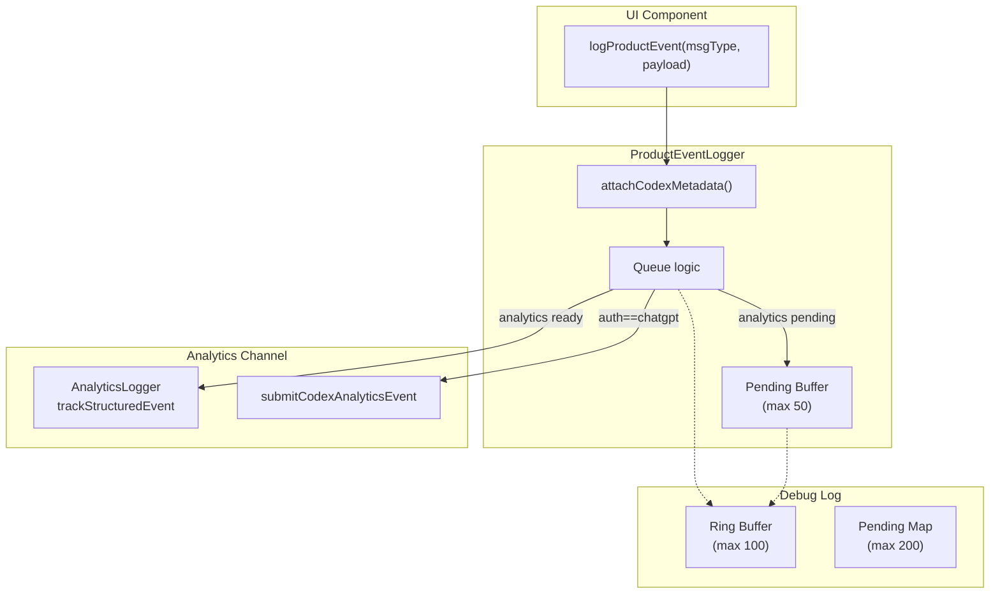
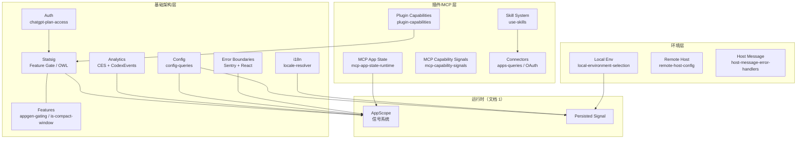

# 04 - State Infrastructure

> Card ID: `c358acd3`
> 分析 Codex 基础架构层：认证、配置、功能开关、分析、国际化、错误边界、插件/MCP 与环境系统。

---

## 1. 系统概述

Codex 的基础架构层由一系列正交子系统组成：

- **认证** — 基于 ChatGPT OAuth 的登录 + Plan 访问控制
- **配置** — 多层 TOML 配置（user/project/system）通过 React Query 访问
- **功能开关** — Statsig Feature Gate + Experiment Layer 双机制
- **分析** — Segment CES + Codex Analytics Events 双通道
- **国际化** — 63 个语言包的动态加载 + 解析器
- **错误边界** — React Error Boundary + Sentry 集成
- **插件/MCP** — Plugin 能力聚合 + MCP App Frame + Skill 系统
- **环境** — 本地开发环境配置 + 远程 Host 连接
- **Host 桥接** — Electron renderer ↔ main 进程消息通道

---

## 2. 身份认证系统

### 2.1 文件位置

`O:\work_space\github.com\@zhzluke96\decode-codex\src\auth\chatgpt-plan-access.ts`

### 2.2 架构

认证核心是一个纯函数决策器 `resolveChatGptPlanAccess`，接收 `ChatGptPlanAccessInput`，返回 `ChatGptPlanAccessResult`：

```typescript
interface ChatGptPlanAccessInput {
  accountId: string | null;
  accountLoading: boolean;
  authLoading: boolean;
  authMethod: string | null;        // "chatgpt" | "apikey" | ...
  authenticatedAccountId: string | null;
  plan: string | null;
  rolloutEnabled: boolean;
  supportedSurface: boolean;
}

type ChatGptPlanAccessResult =
  | { status: "loading" }
  | { status: "allowed"; accountId: string; plan: string }
  | { status: "denied"; reason: ChatGptPlanAccessDeniedReason };
```

### 2.3 Plan 类型

支持 16 种 plan 类型，涵盖 Free、Plus、Pro、Enterprise CBP、Education、Quorum 等：

```typescript
const SUPPORTED_CHATGPT_PLAN_TYPES = [
  PlanType.FREE, PlanType.GO, PlanType.PLUS, PlanType.PRO,
  PlanType.PROLITE, PlanType.SELF_SERVE_BUSINESS, ...
];
```

### 2.4 决策流程

```
supportedSurface? → rolloutEnabled? → authMethod === "chatgpt"? →
accountId exists? → authenticatedAccountId === accountId? →
isSupportedChatGptPlan(plan)? → allowed
```

### 2.5 设计模式

- **Pure Decision Function**：无副作用，所有输入显式传递
- **Union Result Type**：loading / allowed / denied，TypeScript discriminated union
- **Cascading Guard Clauses**：层层过滤，返回具体拒绝原因

---

## 3. 配置与设置系统

### 3.1 配置层

配置系统实现多层 TOML 配置合并，文件位于 `src/config/config-queries/`：

**关键文件：**
- `O:\work_space\github.com\@zhzluke96\decode-codex\src\config\config-queries\public-api.ts`
- `O:\work_space\github.com\@zhzluke96\decode-codex\src\config\config-queries\types.ts`
- `O:\work_space\github.com\@zhzluke96\decode-codex\src\config\config-queries\queries.ts`
- `O:\work_space\github.com\@zhzluke96\decode-codex\src\config\config-queries\mutations.ts`

### 3.2 配置层级

```typescript
type ConfigLayerName =
  | { type: "legacyManagedConfigTomlFromFile"; file: string }
  | { type: "project"; dotCodexFolder: string }
  | { type: "system"; file: string }
  | { type: "user"; file: string };
```

合并顺序：system → user → project → legacyManagedConfig，后层覆盖前层。

### 3.3 查询 Key

```typescript
USER_CONFIG_QUERY_KEY          // ["vscode", "userConfig"]
EFFECTIVE_CONFIG_QUERY_KEY     // ["vscode", "effectiveConfig"]
LAYERED_CONFIG_RESPONSE_QUERY_KEY  // ["vscode", "layeredConfig"]
MCP_SERVERS_CONFIG_QUERY_KEY   // ["vscode", "mcpServers"]
MCP_SERVER_STATUS_QUERY_KEY    // ["vscode", "mcpServerStatus"]
ANALYTICS_CONFIG_QUERY_KEY     // ["vscode", "analytics"]
CONFIG_REQUIREMENTS_QUERY_KEY  // ["vscode", "configRequirements"]
```

### 3.4 React Query Hooks

```typescript
useEffectiveConfigQuery()       // 获取合并后配置
useMcpServersConfigQuery()      // MCP 服务器配置
useMcpResourceQuery()           // MCP 资源查询
useAnalyticsEnabledQuery()      // 分析开关
userConfigQueryOptions()        // 用户配置 query options
useToggleMcpServerEnabledMutation()  // 切换 MCP 启用状态
useWriteMcpServerConfigMutation()    // 写入 MCP 配置
```

### 3.5 设置系统

设置系统位于 `src/settings/`，提供：

- **SettingsPage** — 搜索 + 导航 + 分组
- **Agent Settings** — Codex 行为配置
- **MCP Settings** — MCP 服务器配置
- **Hooks Settings** — Git hooks 设置
- **General Appearance** — 主题/外观
- **Data Controls** — 数据管理
- **Cloud Environments** — 云端环境
- **Keyboard Shortcuts** — 快捷键
- **Usage Queries** — 用量/订阅

**关键抽象：** 每个设置模块独立为 `*-current-runtime.ts` 文件，通过 `chunk producer` 模式导出。

### 3.6 设计模式

- **Layered Config Merger**：多层配置合并，每层可追溯 origin
- **React Query Backed**：所有配置通过 React Query 获取和缓存
- **Config as Data**：`LayeredConfigResponse` 包含 `config`、`origins`、`layers` 三个维度

---

## 4. 功能开关与 Statsig

### 4.1 文件位置

`O:\work_space\github.com\@zhzluke96\decode-codex\src\statsig\`

| 文件 | 功能 |
|------|------|
| `index.ts` | Statsig Provider 导出 |
| `use-feature-gate.ts` | `useFeatureGate(gateName)` hook |
| `statsig-user-runtime.ts` | `buildStatsigUser` / `finalizeStatsigUser` |
| `statsig-bootstrap-runtime.ts` | 登录后 bootstrap |
| `statsig-host-query-runtime.ts` | Host 侧 Statsig 查询 |
| `statsig-network-override.ts` | 网络层覆盖 |
| `owl-feature-runtime.ts` | OWL 功能发布 |

### 4.2 Feature Gate 机制

两层门控：

1. **Statsig 服务端 gate** — 通过 Statsig SDK 远程配置
2. **本地信号同步** — `feature-gate-runtime.ts` 将 gate 值同步到 app-scope 信号族

```typescript
// feature-gate-runtime.ts
export const featureGateSignal = createAppScopedSignalFamily<string, boolean>(
  () => false,
  { onMount(setGateValue, scope) { ... } }
);

export function syncFeatureGateSignalWithStatsigClient(scope, client) {
  // 首次刷新 + 监听 values_updated 事件
}
```

### 4.3 Statsig User 构建

```typescript
export function buildStatsigUser(options): CodexStatsigRawUser
export function finalizeStatsigUser(user): StatsigUser
```

用户标识三步策略：
1. `customIDs.stableID` — 设备稳定 ID
2. `customIDs.account_id` — 登录账户 ID
3. `userID` — 优先 userId，ChatGPT 用户用 `accountUserId`，API Key 用户用 `ua-{stableId}`

自定义属性含：`auth_method`、`plan_type`、`compute_residency`、`brand_name`、`codex_window_type` 等。

### 4.4 OWL Feature Publishing

`owl-feature-runtime.ts` —— OWL（OpenAI 内部实验平台）功能发布机制，与 Statsig 互补。

### 4.5 Statsig Facade

`src/boundaries/statsig.facade.ts` 是兼容层，将 `statsig-current-runtime`（vendor）重新导出给跨边界模块。

### 4.6 设计模式

- **Signal-Gate Sync**：Statsig gate → app-scope signal → React hook
- **User Enrichment**：`buildStatsigUser` 构建原始用户 → `finalizeStatsigUser` 格式化为 Statsig SDK 要求的形状
- **Facade Pattern**：`statsig.facade.ts` 隔离 vendor 依赖

---

## 5. 分析系统

### 5.1 文件位置

`O:\work_space\github.com\@zhzluke96\decode-codex\src\analytics\`

| 文件 | 功能 |
|------|------|
| `analytics-logger.ts` | Segment CES 结构化分析日志 |
| `codex-analytics-event.ts` | Codex 专有分析事件（turn_rating / action / turn_diff） |
| `product-event-logger.ts` | Product Event 注册 + 缓冲队列 |
| `product-event-debug-log.ts` | 调试日志环形缓冲区 |
| `use-product-logger.ts` | 读取 product logger 的 hook |
| `product-logger.ts` | ProductLogger 类型定义 + 事件描述符 |
| `analytics-runtime-externals.ts` | 运行时外部导出 |

### 5.2 双通道分析

#### 通道 1: Segment CES（Customer Event Service）

适用于通用产品事件，通过 `AnalyticsLogger` 实现：

```
useAnalyticsLogger(options)
  → AnalyticsLogger.initialize({ user, statsigClient })
  → AnalyticsLogger.trackStructuredEvent(event, payload)
  → AnalyticsLogger.trackCounter(counter, value)
  → AnalyticsLogger.flush(reason)
```

- 使用 `ChatGPT CES` 端点 `https://chatgpt.com/ces/v1`
- 通过 Segment `writeKey: "oai"` 上报
- Statsig 客户端包装为 `WrappedStatsigClient` 传入 AnalyticsLogger

#### 通道 2: Codex Analytics Events

适用于 Codex 专有分析（turn rating / action / turn diff）：

```typescript
type CodexAnalyticsEvent =
  | CodexTurnRatingAnalyticsEvent
  | CodexActionAnalyticsEvent
  | CodexTurnDiffAnalyticsEvent;
```

- 发送至 `https://chatgpt.com/wham/analytics-events/events`
- 只对 ChatGPT 认证会话启用
- Turn diff 超 1MB 时先裁剪 tree sha/diff，仍超则跳过

### 5.3 Product Event 系统

Product Event 系统是上层抽象，处理缓冲、重试、元数据注入：



- `ProductEventLoggerRegistration` 组件将 logger 发布到 app-scope（`__productLoggerR` 信号）
- 其他模块通过 `useProductLogger()` 或 `logProductEvent(scope, event, payload)` 发送事件
- 调试日志使用 `useSyncExternalStore` 提供实时调试面板

### 5.4 分析上下文构建

```typescript
export function buildCodexAnalyticsContext(options): CodexAnalyticsContext
```

包含：userId、accountId、authMethod、planType、appVersion、windowType、workspaceId 等。

### 5.5 设计模式

- **Two-Queue Processing**：Product Event 缓冲队列 + Debug Log 环形缓冲区
- **Gate-Guarded Initialization**：AnalyticsLogger 在 analytics-enabled gate 通过后初始化
- **Feature Gate Guards**：每个事件出口前检查 `useAnalyticsEnabledQuery`
- **Structured Payload**：事件使用 protobuf 风格的 `$type` 描述符

---

## 6. 国际化（i18n）

### 6.1 文件位置

`O:\work_space\github.com\@zhzluke96\decode-codex\src\i18n\locale-resolver.ts`
`O:\work_space\github.com\@zhzluke96\decode-codex\src\locales\`（63 个语言文件）

### 6.2 解析器架构

```typescript
// locale-resolver.ts
const localeLoaders = {
  "../locales/zh-CN.json": () => import("../locales/zh-cn"),
  "../locales/ja-JP.json": () => import("../locales/ja-jp"),
  // ...63 个语言
};

function resolveLocale(locale): LocaleDescriptor | undefined
function loadLocaleMessages(descriptor): Promise<LocaleMessages>
function normalizeLocale(locale): string
function areEquivalentLocales(left, right): boolean
const DEFAULT_LOCALE = "en-US";
```

### 6.3 解析策略

```
resolveLocale("zh-CN"):
  1. exact match "zh-cn" → 返回
  2. language match "zh" → 第一个匹配
  3. fallback undefined
```

`areEquivalentLocales` 将任何 `en` / `en-*` 视为等价（英语作为回退基准）。

### 6.4 设计模式

- **Lazy Load with Code Splitting**：每个语言包单独 chunk，按需 `import()`
- **Normalize + Fallback Chain**：`normalize` → `exact` → `language` → `undefined`
- **Intl.DisplayNames**：用于在 UI 中显示语言名称

---

## 7. 错误边界系统

### 7.1 文件位置

`O:\work_space\github.com\@zhzluke96\decode-codex\src\boundaries\`

边界文件提供跨模块的兼容转型层：

| 文件 | 功能 |
|------|------|
| `app-scope.tsx` | AppScopeStore 信号运行时（文档 1 详述） |
| `statsig.facade.ts` | Statsig 兼容层 |
| `vscode-api.ts` / `vscode-api-mutation.ts` | VS Code API 封装 |
| `query-core-query.ts` / `query-core-runtime.ts` | Query Core |
| `rpc.facade.ts` | RPC 兼容层 |
| `thread-scope.facade.ts` | Thread 作用域 |

### 7.2 Error Boundary 运行时

`src/runtime/error-boundary/` 目录提供：

- `error-boundary.tsx` — React Error Boundary 组件
- `sentry.ts` — Sentry 集成
- `app-updates.tsx` — 应用更新错误处理
- `renderer-error-boundary-runtime.ts` — 渲染进程错误边界初始化

### 7.3 设计模式

- **Facade Pattern**：每个 boundary 文件包装 vendor chunk 的导出，下游模块不直接依赖 vendor
- **Boundary Isolation**：运行时初始化失败不阻塞应用启动
- **Sentry Integration**：通过 `initRendererSentryRuntimeChunk()` 初始化

---

## 8. 插件系统与 MCP 连接器

### 8.1 文件位置

`O:\work_space\github.com\@zhzluke96\decode-codex\src\plugins\`

**核心模块：**

| 目录/文件 | 功能 |
|-----------|------|
| `plugin-capabilities.ts` | 能力聚合：skill/connector/plugin 分类与去重 |
| `mcp-capability-signals/` | MCP 能力信号族和 JSON-RPC schema |
| `mcp-app-state-runtime.ts` | MCP App 条目/Frame/全屏状态管理 |
| `mcp-app-frame-state.ts` | MCP App Frame 状态 |
| `mcp-app-sandbox-runtime.ts` | MCP App 沙箱 |
| `mcp-app-tool-proxy.ts` | MCP 工具代理 |
| `use-skills.ts` | Skill 查询 hook |
| `use-plugins/` | 插件查询/过滤/排序 |
| `plugins-page-selectors/` | 插件市场选择器 |
| `plugin-detail-page-runtime/` | 插件详情页 |
| `use-is-plugins-enabled/` | 插件启用判断 |

### 8.2 插件能力聚合

`plugin-capabilities.ts` 将 conversation 中使用的 skill/connector/plugin 汇总为能力摘要。

分类体系：

```
CapabilityType: "skill" | "connector" | "plugin"
CapabilityOrigin: "firstParty" | "marketplace" | "custom"
```

去重策略：
- **Catalog 能力**：按 `(type, origin, catalogId)` 三元组去重
- **Custom 能力**：按 type 汇总 distinct count
- **总数上限**：MAX_CAPABILITIES（100）

### 8.3 MCP App 状态管理

`mcp-app-state-runtime.ts` 管理：

- `mcpAppEntriesSignal` — MCP App 条目 Map
- `mcpAppFrameStateFamily` — Frame 状态（展开/全屏/内联）
- `mcpAppManualExpansionFamily` — 手动展开
- `mcpAppSidePanelOpenFamily` — 侧边栏打开状态
- `mcpToolActivityExpansionFamily` — 工具活动展开

### 8.4 MCP 能力信号

`mcp-capability-signals/`：

- `mcpAppEntrypointsSignal` — 所有 MCP App 入口
- `capabilityMentionServersSignal` — @提及的服务器
- `localMcpCapabilityCatalogSignal` — 本地能力目录
- `mcpJsonRpcRequestPayloadSchema` / `mcpToolCallRequestSchema` — JSON-RPC schema

### 8.5 Skill 系统

`use-skills.ts` 提供：

```typescript
function useSkills(cwd?, hostId?, options?): UseSkillsResult
```

- 通过 `sendAppServerRequest("list-skills-for-host")` 获取
- 支持 cwd 列表、host 覆盖、5 分钟缓存
- `skills_refresh_nonce` shared-object 信号驱动刷新

### 8.6 连接器系统

`O:\work_space\github.com\@zhzluke96\decode-codex\src\connectors\`

| 文件 | 功能 |
|------|------|
| `ambient-suggestion-apps.ts` | 环境建议应用 |
| `imported-connector-apps.ts` | 导入的连接器 |
| `app-connect-oauth/` | OAuth 连接 |
| `apps-queries/` | 应用查询 CRUD |

### 8.7 设计模式

- **Capability Aggregator**：`aggregatePluginCapabilities` 将展开的 skill/toolCall 列表聚合为紧凑摘要，用于遥测
- **Signal Family State**：MCP app 每个实例的状态通过 scoped signal family 管理（key = mcpAppId）
- **Query + Refresh Nonce**：Skill 列表通过 React Query 缓存 + shared-object nonce 驱动刷新
- **JSON-RPC Schema 定义**：MCP 协议消息使用 Zod schema 验证

---

## 9. 环境系统

### 9.1 文件位置

`O:\work_space\github.com\@zhzluke96\decode-codex\src\environments\`

| 文件 | 功能 |
|------|------|
| `local-environment-selection/` | 本地环境选择：路径/状态/选择逻辑 |
| `local-environments-utils/` | 环境工具：TOML 解析/默认值 |
| `local-environment-create-route.ts` | 创建路径 |

### 9.2 本地环境选择

```typescript
// local-environment-selection/index.ts 导出
resolveLocalEnvironmentSelection(options)    // 解析环境选择
selectDefaultLocalEnvironment()              // 选择默认环境
useLocalEnvironmentSelection(options)        // React hook
setWorktreeLocalEnvironmentConfigPath()      // 设置 worktree config 路径
localEnvironmentSelectionsByWorkspaceAtom    // AppScope atom
```

### 9.3 远程 Host

`O:\work_space\github.com\@zhzluke96\decode-codex\src\runtime\shared-object-host-runtime\remote-host-config.ts`

```typescript
useRemoteHostConfigs()              // 远程 host 配置列表
useSharedObjectHostConfigById()     // 按 ID 查询
isCurrentHostLocal()                // 当前 host 是否本地
findRemoteHostConfigById()          // 纯函数查找
```

### 9.4 Host 系统

`O:\work_space\github.com\@zhzluke96\decode-codex\src\host\host-message-error-handlers.ts`

```typescript
export function logInvalidHostMessage(error): void  // 记录无效消息
export function ignoreHostRequestError(): void       // 静默吞错误
```

### 9.5 设计模式

- **Selection Resolution Chain**：`resolveLocalEnvironmentSelection` 链式解析工作目录→环境配置路径
- **Shared-Object Host Config**：远程连接配置通过 SharedObject bridge 跨进程同步
- **Host Message Handler**：消息错误分 logging / ignoring 两类处理

---

## 10. 整体架构图



---

## 11. 抽象与设计模式总结

| 模式 | 使用位置 | 说明 |
|------|----------|------|
| Pure Decision Function | Auth | `resolveChatGptPlanAccess` 无副作用 |
| Layered Config Merger | Config | System → User → Project → Legacy |
| Signal-Sync Pattern | Statsig | Gate 值从 Statsig SDK 同步到 AppScope Signal |
| Facade Pattern | Boundaries | `statsig.facade.ts` 隔离 vendor |
| Two-Queue Processing | Analytics | Product Event 缓冲 + Debug Log 环形缓冲区 |
| Lazy Load + Code Split | i18n | 63 个语言包按需 `import()` |
| Capability Aggregator | Plugins | `aggregatePluginCapabilities` 压缩遥测摘要 |
| Signal Family State | MCP | 每个 App 实例状态 = keyed signal |
| Selection Resolution Chain | Environments | 工作目录→配置路径链式解析 |
| Optimistic Update + Rollback | Config | Mutation 先更新缓存再发请求 |
| Union Result Type | Auth | `loading / allowed / denied` discriminated union |