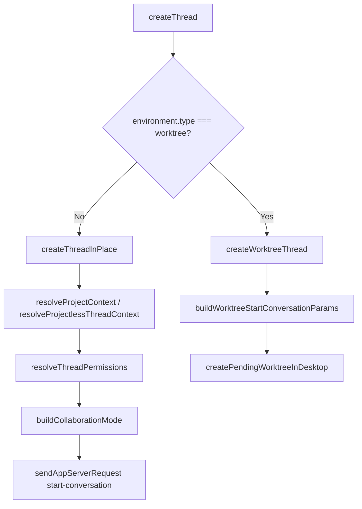
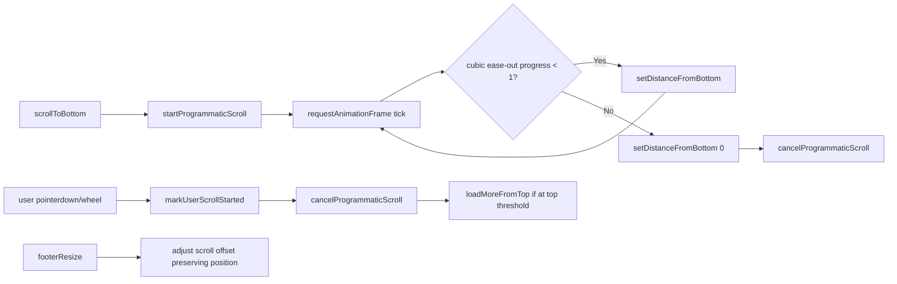

# 05-Thread-Conversation-System：线程、会话、编辑器与反馈系统

## 概述

Codex 的线程与会话系统是整个应用的核心交互领域模型。它管理从线程创建、对话渲染、编辑器输入到产物展示和用户反馈的完整生命周期。系统横跨 `src/thread/`、`src/threads/`、`src/thread-summary/`、`src/conversations/`、`src/composer/`、`src/artifacts/`、`src/turn-rating/` 和 `src/feedback/` 八个模块。

---

## 1. 线程系统

### 1.1 线程生命周期

#### 创建线程

[**src/threads/create-thread.ts**](O:/work_space/github.com/@zhzluke96/decode-codex/src/threads/create-thread.ts) 是线程创建的核心入口。定义三种目标类型：

- `project` — 在本地项目中创建线程，通过 `resolveProjectContext` 获取项目上下文
- `remoteProject` — 在远程主机上创建线程，需指定 hostId 和 path
- `projectless` — 无项目环境的临时线程，使用 `resolveProjectlessThreadContext`

创建流程分为两条路径，由 `environment.type === "worktree"` 条件决定：



`createThreadInPlace` 的完整流程：
1. 根据 target.type 解析 cwd、workspaceRoots、workspaceKind、projectAssignment
2. 调用 `resolveThreadPermissions` — 读取 host config，合并权限和 workspace roots
3. 构建 `collaborationMode`（含模型选择和 reasoning effort）
4. 调用 `sendAppServerRequest("start-conversation", ...)` 发送到 app server
5. 返回 `{ threadId, projectlessOutputDirectory? }`

`createWorktreeThread` 用于 worktree 环境：
1. 调用 `buildWorktreeStartConversationParams` 构建启动参数
2. 调用 `createPendingWorktreeInDesktop` 创建 PendingWorktree，返回 `{ pendingWorktreeId }`
3. PendingWorktree 异步完成后自动启动会话

#### 线程上下文信号

[**src/threads/thread-context/index.ts**](O:/work_space/github.com/@zhzluke96/decode-codex/src/threads/thread-context/index.ts) 定义基于路由的 computed signal 系统：

```typescript
// 路由类型
type ThreadRouteScope =
  | { routeKind: "home" | "new-thread-panel"; projectContext? }
  | { routeKind: "local-thread"; conversationId: string; projectContext? }
  | { routeKind: "remote-thread" | "chatgpt-thread" }
  | { routeKind: "other" };
```

核心信号：
- `threadExecutionContextSignal` — 综合计算出的执行上下文（cwd, hostId）
- `threadHostIdSignal` — 从 `threadExecutionContextSignal` 派生
- `threadCwdSignal` — 当前 cwd
- `threadHostConfigSignal` — 按 hostId 查询配置
- `threadCodexHomeSignal` — Codex Home 路径
- `threadHostConfigWorktreeKeySignal` — worktree 键标准化

每种路由的解析策略：
- **home/new-thread-panel**: 从 `activeLocalWorkspaceRootSignal`、`selectedRemoteProjectSignal` 生成 cwd/hostId
- **local-thread**: 查询 `threadProjectAssignmentsSignal`、`conversationCwdSignal`、`conversationHostIdSignal`
- **remote-thread/chatgpt-thread**: 仅使用 defaultThreadHostIdSignal

#### 线程操作 Actions

[**src/threads/thread-actions/**](O:/work_space/github.com/@zhzluke96/decode-codex/src/threads/thread-actions/) 通过 `useThreadActions` hook 返回 `ThreadActions` 接口：

- `archiveThread({ conversationId, hostId, source, onArchiveStart/Success/Error })` — 归档对话，发送 `archive-conversation` 请求
- `interruptThread({ conversationId })` — 中断对话，发送 `interrupt-conversation` 请求，`initiatedBy: "user"`
- `renameThread({ conversationId, hostId, title })` — 发送 `set-thread-title` 请求
- `markThreadAsUnread({ conversationId, hostId })` — 发送 `mark-conversation-as-unread`
- `copyAppLink(conversationId?)` — 复制 `codex://threads/{conversationId}`
- `copySessionId(sessionId?)` — 复制 session ID
- `copyConversationMarkdown({ conversationId, getMarkdown })` — 先确保历史加载完成，获取 MD 后复制
- `copyWorkingDirectory(cwd?)` — 复制 cwd 路径

错误处理：所有操作失败时使用 `scope.get(toastApiSignal).danger(message)` 显示错误提示。

**排序与顺序管理**（`ordering.ts`）：
- `getResolvedVisibleThreadOrder` — 合并 pending 顺序变更和实际可见线程键
- `getSidebarThreadEntityIds` — 从 sidebar thread key 提取 entity ID
- `getThreadTaskKeys` — 过滤掉 pending-worktree 后提取 task keys
- `sortThreadTasksByPinnedOrder` — 按钉选顺序排序
- `areThreadKeyArraysEqual` / `areThreadKeysShallowEqual` — 顺序比对

**钉选管理**（`pinning.ts`）：
- `usePinnedThreadState` — 钉选状态 hook
- `setPinnedThreadOptimistically` — 乐观更新钉选状态

#### 动态工具

[**src/threads/thread-dynamic-tools/**](O:/work_space/github.com/@zhzluke96/decode-codex/src/threads/thread-dynamic-tools/) 供 Agent 在运行时调用：

**resolve-thread-host.ts** — 多主机线程查找：
1. 获取所有已连接的主机管理器（`getConnectedThreadManagers`）
2. 如果提供了 `preferredHostId`，先尝试在首选主机上读取线程
3. 失败后在所有主机上并行搜索（`findThreadOnManager`），搜索 active + archived 线程
4. 唯一匹配直接返回；无匹配抛 "No Codex thread found"；多匹配抛 "Ambiguous" 错误

**archive-thread-tool.ts** — Agent 归档工具：
- 先 resolve host，然后视 `archived` 标志调用 `archive-conversation` 或 `unarchive-conversation`
- 归档前先 `hydrate-background-threads` 确保背景线程已加载

**read-thread-turns-tool.ts** — Agent 读取 turn 工具：
- 分页读取，最新优先
- 支持 `truncateText` 裁剪输出（保留原始字符数统计）
- 序列化用户消息内容，处理 text/image/file/url 等不同类型
- 序列化线程状态（active/idle/notLoaded/systemError）

#### 线程认证

[**src/thread/thread-tool-auth.ts**](O:/work_space/github.com/@zhzluke96/decode-codex/src/thread/thread-tool-auth.ts) 处理动态工具的认证：

- local 主机：直接返回 `auth.authMethod`
- 远程主机：通过 `fetchThreadToolAuthMethod` 异步获取，带 1000ms 超时
- 超时或失败时返回 `{ authMethod: null, isAuthLoading: true }`

### 1.2 PendingWorktree 存储

[**src/threads/pending-worktree-store/**](O:/work_space/github.com/@zhzluke96/decode-codex/src/threads/pending-worktree-store/) 管理异步 worktree 创建的完整状态机：

**阶段**（`PendingWorktreePhase`）：`queued` -> `creating` -> `setting-up` -> `worktree-ready` | `failed`

**启动模式**（`PendingWorktreeLaunchMode`）：
- `create-stable-worktree` — 创建稳定 worktree
- `fork-conversation` — fork 对话到新 worktree
- `start-conversation` — 在新 worktree 启动对话

**PendingWorktree 字段**：attempt、createdAt、errorMessage、hostId、id、isPinned、label、needsAttention、outputText、phase、prompt、sourceWorkspaceRoot、worktreeGitRoot、worktreeWorkspaceRoot 等

**Store Actions**（`PendingWorktreeStoreActions`）：
- `createPendingWorktree` — 创建并返回 ID
- `cancelPendingWorktree` — 取消
- `retryPendingWorktree` — 重试
- `dismissPendingWorktree` — 解除
- `setPendingWorktreePinned` / `renamePendingWorktree` / `clearPendingWorktreeAttention`

**Thread Goal 系统**：
- `ThreadGoalDraft` — 包含 objective、imageAttachments、pastedTextAttachments
- `MaterializedThreadGoal` — 物化后含 attachmentDirectory + objective
- 操作：`setThreadGoal`、`clearThreadGoal`、`setThreadGoalStatus`、`materializeThreadGoalDraft`、`cleanupMaterializedThreadGoal`、`readMaterializedThreadGoalObjective`

### 1.3 Fork 对话

[**src/threads/fork-conversation.ts**](O:/work_space/github.com/@zhzluke96/decode-codex/src/threads/fork-conversation.ts) 支持两种环境：

- **same-directory**: 立即创建子线程（`sendAppServerRequest("start-conversation", ...)`），使用 `FORk_INTO_SAME_DIRECTORY_CONTINUATION` 说明
- **worktree**: 异步 pending worktree fork（`createPendingWorktreeInDesktop`），使用 `FORk_INTO_WORKTREE_CONTINUATION` 说明

fork 过程中通过 `applyForkedConversationPanelState` / `stashPendingWorktreePanelState` 捕获源面板布局。

### 1.4 线程摘要与环境切换

[**src/thread-summary/local-remote-dropdown-parts/**](O:/work_space/github.com/@zhzluke96/decode-codex/src/thread-summary/local-remote-dropdown-parts/) 提供 Composer 模式切换下拉菜单：

- `LocalRemoteDropdownProps` — composerMode、conversationId、footerRemoteState、threadHandoffSummary、worktreeLabelOnly 等
- `CloudEnvironmentDropdownProps` — 云环境选择
- `DropdownOption` — 每个选项的 id（composerMode）、label、description、disabled
- `ThreadHandoffSummary` — 含 conversationTitle、cwd、isWorktreeConversation
- `ComposerMode`: cloud / local / worktree

### 1.5 Git 分支同步

[**src/thread/update-thread-git-branch.ts**](O:/work_space/github.com/@zhzluke96/decode-codex/src/thread/update-thread-git-branch.ts) 将 Git 分支信息同步到服务端：

```typescript
interface ThreadGitInfo {
  branch: string | null;
  sha: string | null;
  originUrl: string | null;
}
```

调用 `sendRequest("thread/metadata/update", ...)` 后通过 `updateConversationState` 更新本地状态。

### 1.6 滚动布局

[**src/threads/thread-scroll-layout/**](O:/work_space/github.com/@zhzluke96/decode-codex/src/threads/thread-scroll-layout/) 实现线程视图的完整滚动控制系统：

**`useThreadScrollLayoutController`** hook：
- 滚动到底部（`scrollToBottom`）：使用 `requestAnimationFrame` 驱动 cubic ease-out 动画，`SCROLL_TO_BOTTOM_DURATION_MS` 控制时长
- 用户滚动检测：通过 `pointerdown` 和 `wheel` 事件标记用户滚动开始，`USER_SCROLL_LISTENER_WINDOW_MS` 窗口期内持续通知
- 上拉加载更多（`loadMoreFromTop`）：当滚动到顶部时触发 `onUserScrollToTop`，支持多次触发直到返回 "stop"
- 布局变化保持（`PreserveScrollPosition`）：footer 高度变化时自动调整滚动偏移



**类型**（`types.ts`）：
- `ThreadScrollLayoutHandle` — `scrollToBottom()`
- `ThreadScrollLayoutProps` — 支持 `contentX`（framer-motion x 偏移）、footer、initialOffset、onScroll、onUserScrollToTop、remoteHostedPIPAnchorHostId 等
- `BottomPanelScrollSync` — 底部面板滚动同步回调

---

## 2. 会话系统

### 2.1 架构总览

`src/conversations/` 是 Codex 最大的模块，约 200+ 个文件，按功能分为：

```mermaid
flowchart TD
    subgraph 路由与页面
        A[local-conversation-route-runtime] --> B[local-conversation-page-runtime]
        B --> C[local-conversation-thread-parts/]
    end

    subgraph 消息处理
        D[local-conversation-messaging] --> E[startComposerTurn]
        E --> F[sendHostRequest start-turn/steer-turn]
    end

    subgraph Turn 渲染
        G[partition-turn-items] --> H[group-renderable-agent-items]
        H --> I[turn-render-unit-runtime]
        I --> J[turn-render-helpers]
        J --> K[turn-collapse-state]
    end

    subgraph 工具活动分组
        L[tool-activity-runtime] --> M[tool-activity-descriptors]
        M --> N[tool-activity-summary-accumulator]
        N --> O[conversation-activity-grouping-runtime]
    end

    subgraph MCP 与 Handoff
        P[mcp-tool-activity/]
        Q[thread-handoff-*]
        R[background-subagents-runtime]
    end

    subgraph 导出
        S[conversation-markdown]
    end
```



### 2.2 页面运行时

[**src/conversations/local-conversation-page-runtime.ts**](O:/work_space/github.com/@zhzluke96/decode-codex/src/conversations/local-conversation-page-runtime.ts) 是本地对话页面的容器运行时。它从 `vendor/projects-app-shared-runtime` 导入大量信号并重新导出：

关键信号：
- `conversationTurnsSignal` — 所有 turn 的列表
- `conversationHostIdSignal` / `conversationCwdSignal` / `conversationModeSignal`
- `conversationModelSignal` / `conversationReasoningEffortSignal`
- `localResponseInProgressSignal` — 本地响应是否进行中
- `latestConversationTurnSignal` — 最新的 turn
- `lastTurnDiffSignal` / `lastTurnCwdSignal`
- `rightPanelController` / `rightPanelOpenSignal` / `rightPanelTabController` / `rightPanelVisibleSignal`
- `selectedSummaryPanelSignal` / `summaryPanelPinnedSignal`

### 2.3 Turn 分区

[**src/conversations/partition-turn-items/**](O:/work_space/github.com/@zhzluke96/decode-codex/src/conversations/partition-turn-items/) 将 turn items 按类型分区：

- `turn-agent-item-groups.ts` — 合并同一 turn 中的 agent items 为渲染单元组
- `slice-turn-items-after-intro.ts` — 在 intro 之后切片，支持 `startAfterTurnIntro` 参数

分区输出类型集合：
- `userItems` — 用户消息
- `assistantItem` — 助手回复
- `agentItems` — Agent 活动（exec、patch、tool-call 等）
- `automationUpdateItems` — 自动化更新
- `toolOutputItems` — 工具输出
- `postAssistantItems` — 助手之后的活动
- `systemEventItem` / `streamErrorItem` — 系统事件
- `remoteTaskCreatedItems` — 远程任务创建
- `personalityChangedItems` / `forkedFromConversationItems` — 元事件
- `modelChangedItems` / `modelReroutedItems` — 模型变更
- `todoListItem` / `proposedPlanItem` / `planImplementationItem` — 计划项
- `mcpServerElicitationItems` — MCP 服务器提示
- `permissionRequestItems` / `approvalItem` / `userInputItem` — 交互项

### 2.4 Tool Activity 分组系统

工具活动分组是 Codex 渲染系统中最复杂的子系统，包含 6 个核心文件：

**tool-activity-runtime.ts** — 运行时抽象：
- `toToolActivitySummaryUnit` — 将活动单元转换为摘要单元
- `DynamicToolCallItem` — 动态工具调用类型（含 namespace、tool、completed 等）
- `ToolActivityVariant`: row / summary / summary-text

**tool-activity-descriptors.ts** — 注册表模式：
```typescript
interface ToolActivityDescriptor {
  namespace: string;
  tool: unknown;
  render?: (item, variant) => unknown;
  getCompletedSummaryPartKey?: (item) => string | undefined;
  continuesLiveActivityBetweenCalls?: boolean;
  summaryOnlyInConversationGroup?: boolean;
  standaloneInConversation?: boolean;
}
```

核心工具的描述符注册示例：
- `threadsForkTool` / `threadsForkInWorktreeTool` — 使用 `getThreadsForkSummaryPartKey`
- `threadsReadTool` — `standaloneInConversation: true`
- `threadsListTool` — `summaryOnlyInConversationGroup: true`
- `threadsCreateTool` / `threadsCreateInWorktreeTool` — `continuesLiveActivityBetweenCalls: true`

**tool-activity-summary-accumulator.ts** — 汇总相邻活动：
- 将相邻的 exec/patch/tool-call 折叠为 `collapsed-tool-activity` 单元
- 生成摘要描述（如"Read 3 files, ran 2 commands"）

**conversation-activity-types.ts** — 类型定义：
- `RenderEntry`: item | exploration
- `ActivityGroup`: entry | multi-agent-group | web-search-group
- `ActivityUnit`: collapsed-tool-activity | pending-mcp-tool-calls | dynamic-tool-call-group | ActivityGroup

### 2.5 Renderable Agent Items 分组

[**src/conversations/group-renderable-agent-items.ts**](O:/work_space/github.com/@zhzluke96/decode-codex/src/conversations/group-renderable-agent-items.ts) 将 agent 的 turn items 合并为可渲染单元：

- 连续的文件探索（`read` / `search` / `list_files`）折叠为单个 `exploration` 组
- 返回 `RenderableAgentUnit[]`，每个单元是 `item` 或 `exploration`
- 同时计算 `isExploring`（Agent 是否仍在探索）和 `isAnyNonExploringAgentItemInProgress`

### 2.6 Turn 折叠状态

[**src/conversations/turn-collapse-state.ts**](O:/work_space/github.com/@zhzluke96/decode-codex/src/conversations/turn-collapse-state.ts) 管理每个 turn 的折叠：

- `computeTurnCollapseState` — 综合是否允许折叠、是否自动折叠
- `PartitionedCollapseEntries` — 将条目分为：collapsibleEntries、expandedEntries、persistentEntries、preToggleEntries
- 持久条目（persistent）：MCP 应用窗口类型始终可见
- `shouldAllowCollapse`：仅当有 renderable agent items 且无最终助手消息时允许

### 2.7 Markdown 导出

[**src/conversations/conversation-markdown.ts**](O:/work_space/github.com/@zhzluke96/decode-codex/src/conversations/conversation-markdown.ts) 是完整的 Markdown 导出器。`renderConversationMarkdown` 遍历每个 turn 并将各类 item 转换为 MD：

| Item 类型 | Markdown 输出 |
|-----------|--------------|
| user-message | 引用块 + 附件列表 + 图片 + 评论 + 上下文 |
| assistant-message | 纯文本内容 |
| exec | `<details>` bash 代码块 + 输出 + 执行状态 |
| patch | 逐文件的 `<details>` diff 代码块 + 增减统计 |
| mcp-tool-call | MCP 调用描述 + JSON 参数 + 结果 |
| dynamic-tool-call | 工具调用描述 |
| web-search | "Searched the web for {query}" |
| generated-image | `` |
| todo-list | `- [x]` 带复选框的列表 |
| proposed-plan | `### Plan` 标题块 |
| system-error / stream-error | 错误代码块 |
| context-compaction | 元数据块 |
| 工具活动组 | 折叠的 `<details>` 块 |

### 2.8 MCP Tool Activity

[**src/conversations/mcp-tool-activity/**](O:/work_space/github.com/@zhzluke96/decode-codex/src/conversations/mcp-tool-activity/) 提供 MCP 工具的自定义展示标签：

- `mcp-tool-label-registry-runtime.ts` — 标签注册表运行时
- `mcp-tool-display-label.ts` — 统一显示标签
- `mcp-app-resource-runtime.ts` — MCP 应用资源管理
- 平台特定标签：`slack-mcp-tool-activity-labels.ts`、`notion-mcp-tool-activity-labels.ts`、`vercel-mcp-tool-activity-labels.ts`、`sites-mcp-tool-activity-labels.ts`

### 2.9 Background Subagents

[**src/conversations/background-subagents-runtime.ts**](O:/work_space/github.com/@zhzluke96/decode-codex/src/conversations/background-subagents-runtime.ts) 聚合后台子代理的活动信息：

- `buildBackgroundAgents` — 从缓存对话和 source linked threads 提取子代理状态
- 返回 `BackgroundAgentSummary[]`，含 diff 统计、线程状态、内联活动标志

### 2.10 Thread Handoff

线程切换（handoff）系统包含多个文件：
- `handoff-thread-runner.ts` — 后台 runner，订阅 git service 的 `thread-handoff-progress` 事件
- `handoff-thread-tool-handlers.ts` — handoff 工具处理器
- `thread-handoff-progress.ts` — 进度状态追踪
- `thread-handoff-composer-status.ts` — 检查 composer 是否可以 handoff（检查 pending pasted text attachments / queued follow-ups）
- `thread-handoff-boundary-runtime.ts` — handoff 边界运行时
- `handoff-thread-types.ts` — 类型定义
- `handoff-thread-context.ts` / `handoff-thread-local-plan.ts` / `handoff-thread-cross-host-plan.ts` — 计划和上下文

---

## 3. 编辑器与输入系统

### 3.1 Composer 架构

`src/composer/` 实现 Codex 的输入编辑器，基于 ProseMirror 富文本编辑器，包含 80+ 个文件。

```mermaid
flowchart TD
    subgraph 编辑器核心
        A[composer-store.ts] --> B[ProseMirror]
        C[composer-scope-runtime.ts] --> D[ComposerScope]
        E[composer-view-state/] --> F[ComposerViewState]
        G[composer-state-runtime.ts] --> H[state atoms]
    end

    subgraph 提交流程
        I[start-composer-turn.ts] --> J[buildComposerTurnPayload]
        I --> K[sendHostRequest start-turn/steer-turn]
        L[composer-submit.ts] --> M[performComposerSubmit]
        N[composer-turn-request-builder.ts] --> O[buildAttachmentsPayload]
    end

    subgraph 附件系统
        P[attachment-builders.ts] --> Q[splitCommentsForSubmit]
        P --> R[buildComposerImageInputItems]
        S[attachment-hooks.ts] --> T[useComposerAttachmentActions]
        U[attachment-helpers.ts] --> V[pickBrowserFiles]
    end

    subgraph 建议系统
        W[mention-autocomplete.ts] --> X[@-mention]
        W --> Y[/command]
        Z[suggestion-list/] --> AA[UI 列表]
    end

    subgraph 辅助
        AB[keyboard-actions.ts] --> AC[快捷键]
        AD[dictation.ts] --> AE[语音]
        AF[service-tier.ts] --> AG[服务层]
    end
```

### 3.2 视图状态

[**src/composer/composer-view-state/**](O:/work_space/github.com/@zhzluke96/decode-codex/src/composer/composer-view-state/) 定义完整的 Composer 视图状态：

**ComposerViewState 字段**：
- `composerMode`: cloud / local / remote / worktree
- `fileAttachments` / `imageAttachments` / `addedFiles` / `pastedTextAttachments` — 所有附件类型
- `commentAttachments` — 评论附件
- `selectedTextAttachments` — 选择的文本片段
- `imageCommentDraft` — 图片标注草稿
- `isAutoContextOn` — 自动上下文开关
- `promptText` — 当前输入文本
- `pullRequestChecks` / `pullRequestMergeConflict` — PR 状态
- `defaultBranchSnapshot` — 默认分支快照
- `aeonStartTarget` / `followUpCloudStartingState` / `asyncThreadStartingState` — 异步启动状态

**模块组成**：
- `types.ts` — 所有类型定义
- `default-state.ts` — 默认值
- `mutations.ts` — 状态变更（`setComposerModeForScope`、`updateComposerViewStateField`、`addSelectedTextAttachment` 等）
- `selectors.ts` — 派生状态选择器
- `prompt-drafts.ts` — 提示草稿持久化（`persistPromptDraft`、`restoredLocalComposerStateState`）
- `remote-state.ts` — 远程任务相关状态（`cloudComposerContextState`、`remoteTaskTurnsState`）
- `remote-turn-tree.ts` — 远程 turn 树构建和选择

### 3.3 提交流程

**start-composer-turn.ts** — turn 生命周期管理：
1. `startComposerTurn` 启动新 turn:
   - `assertConversationOpen` — 检查对话是否已关闭
   - `prepareConversationForTurn` — 准备对话
   - `buildComposerTurnPayload` — 构建 payload
   - `sendHostRequest("start-turn", ...)` — 发送启动请求
2. `sendRestoreMessage` 发送 steer 消息:
   - 发送 `sendHostRequest("steer-turn", ...)` + `restoreMessage`
   - 如果 steer 失败且 `isSteerTurnInactiveError`，fallback 到 `startTurn`
3. `maybeResumeConversation` — 恢复可恢复的对话

**composer-turn-request-builder.ts** — payload 构建：
- `buildComposerTurnPayload` — 合并文件附件、粘贴文本、addedFiles 和图片输入
- `buildPermissionRequestFields` — 构建权限字段（序列化权限策略、权限覆盖）
- `isClosedAgentConversation` — 通过遍历 turn items 中的 `collabAgentToolCall` 检查

**composer-submit.ts** — 提交处理逻辑：
- `performComposerSubmit` — 完整的提交生命周期：
  1. 检查阻止条件（submitBlockReason、empty prompt 等）
  2. 调用 `prepareGoalSubmit` 准备目标提交
  3. 构建 prompt 追加到历史
  4. 检查队列消息（`maybeSendQueuedSteerMessage`）
  5. 执行实际提交
  6. 处理错误和日志

### 3.4 附件系统

由六个文件构成：

**attachment-builders.ts**：
- `splitCommentsForSubmit` — 将图片标注草稿转换为文本（`(x%, y%) text` 列表）后拼接到 prompt
- `buildComposerImageInputItems` — 构建图片 input items
- `normalizeConversationAttachments` — 去重合并附件列表
- `ConversationInputAttachment` — 附件输入类型

**attachment-atoms.ts** — Jotai atoms：`composerImageCommentDraftAtom`、`composerImageInputsAtom`

**attachment-hooks.ts** — React hooks 封装

**attachment-helpers.ts** — 工具函数：`deriveImageFilename`、`bytesToBase64`、`firstNonEmptyLine`、`pickBrowserFiles`（创建隐藏 `<input>` 元素触发文件选择）

### 3.5 建议系统

**mention-autocomplete.ts** — @-mention 和 skill-mention 自动完成：
- `useAtMentionAutocomplete` — @ 提及（"Add context" 菜单）
- `useSkillMentionAutocomplete` — 技能提及（/commands）
- 通过 `useComposerControllerSelector` 读取 ProseMirror 编辑器的 `composer-suggestion-ui` 插件状态
- `SuggestionMenuState` — 菜单打开状态、查询文本、选中项

**suggestion-list/** — UI 列表组件：
- `ComposerSuggestionListProps` — `sections`（含 `id`、`title`、`items`）、`isActive`、`onSelect`、`onHighlight`
- `useCloseOnNoResults` — 当查询有空格但无结果时自动关闭
- `plugin-filter.ts` — 插件过滤支持

### 3.6 其他编辑器功能

- **composer-keyboard-actions.ts** — 键盘快捷键映射
- **composer-dictation.ts** / **composer-dictation-focus.ts** — 语音输入支持
- **composer-command-keymap.ts** — 命令键映射
- **use-composer-prompt-history.ts** — 提示历史（localStorage 持久化）
- **use-composer-mode.ts** — composer 模式选择 hook
- **use-service-tier.ts** — 服务层级选择
- **reasoning-effort-options.ts** — 推理力度选项列表
- **model-option-helpers.ts** — 模型选项辅助
- **composer-banners/** — 横幅提示组件
- **composer-footer-branch-switcher/** — footer 分支切换器
- **project-selector/** — 项目选择器
- **prompt-text/** — 提示文本解析和链接检测

---

## 4. 代码产物系统

### 4.1 Notebook 预览

[**src/artifacts/**](O:/work_space/github.com/@zhzluke96/decode-codex/src/artifacts/) 实现 Jupyter Notebook 的只读预览：

**类型**（`notebook-preview-types.ts`）：
- `ParsedNotebookDocument` — cells + title
- `NotebookCell`: `NotebookCodeCell`（含 descriptionMarkdown、executionCount、outputs）、`NotebookMarkdownCell`、`NotebookRawCell`
- `NotebookOutput`: text / image / html / json / stream / error 六种
- `NotebookParseResult`: ready / error

**解析器**（`notebook-preview-parser.ts`）：
- `parseNotebookContents(contentsBase64)` — 解码 Base64 -> JSON.parse -> `parseNotebookDocument`
- 从 metadata 中提取 Codex 命名空间下（`codex` / `codexNotebook` / `codex_notebook` / `codex-app`）的 title 和 description
- `parseNotebookOutput` 处理各种输出类型（text/execute_result/display_data/stream/error）

### 4.2 输出产物运行时

[**src/conversations/output-artifact-runtime.ts**](O:/work_space/github.com/@zhzluke96/decode-codex/src/conversations/output-artifact-runtime.ts) 和 `output-artifact-runtime-parts/` 提供产物相关辅助函数：

- `collectTurnFileArtifacts` — 从 turn 提取文件产物列表
- `resolveWorkspacePathFromCwd` — 从 cwd 解析工作空间路径
- `normalizeArtifactPathKey` / `normalizeHref` — 路径标准化
- `isFileReferencePath` / `isFileUrlLikeTarget` — 路径类型检查
- `isResourcePathInsideProjectlessOutput` — 检查是否在 projectless 输出目录内
- `mapTurnStatusToOutputStatus` — turn 状态到输出状态的映射

---

## 5. 评价和反馈系统

### 5.1 Turn Rating

`src/turn-rating/` 目录未包含 TypeScript 源文件。

### 5.2 反馈系统

[**src/feedback/**](O:/work_space/github.com/@zhzluke96/decode-codex/src/feedback/) 实现用户反馈功能：

**分类选项**（`feedback-categories.ts`）：
- `bug` — 报告 Bug
- `bad-result` — 报告不满意的结果
- `good-result` — 报告满意的结果
- `safety_check` — 安全检查反馈
- `other` — 其他

**提交流程**（`submit-feedback.ts`）：
```typescript
async function submitFeedback(params: SubmitFeedbackParams): Promise<SubmitFeedbackResult>
```
1. 获取 app info（`appHostServices.appInfo.get()`）
2. 构建 tags：`buildThreadFeedbackTags(threadId)` + app_version / app_build / buildFlavor
3. 如果需要桌面日志归档，调用 `dispatchHostRequest("feedback-desktop-log-archive")`
4. 调用 `sendAppServerRequest("submit-feedback", ...)` 发送给服务端
5. finally 块中清理临时归档文件

**UI 组件**（通过 `index.ts` 导出）：
- `FeedbackDialog` / `FeedbackDialogSubmission` — 反馈对话框
- `FeedbackCommandRegistrar` — 反馈命令注册器
- `UploadResultDialog` / `UploadedAssetRow` — 上传结果展示

---

## 设计模式总结

1. **信号驱动架构** — 大量使用 `createComputedSignal`、`createSignalToken`、`createAtom` 等信号原语，通过 `appScope` 依赖注入，支持 computed/derived signal 级联更新
2. **运行时 Chunk 初始化** — 每个子系统的延迟初始化模式（`init*Chunk` / `init*Runtime`），兼容 Rollup 代码分割
3. **Facade 模式** — 通过 `xxx.facade` 模块导入边界依赖，实现模块间解耦
4. **路由驱动的 Computed Signal** — 线程上下文信号根据当前路由类型动态计算，路由变化自动派生新上下文
5. **分组-折叠-展开渲染管线** — 三层渲染：原始 items → renderable units → activity groups → 折叠后的 UI 块
6. **异步 Worktree 状态机** — PendingWorktree 的四阶段状态机（queued/creating/setting-up/ready|failed）
7. **注册表模式** — ToolActivityDescriptor 注册表，每个工具独立声明渲染/分组行为
