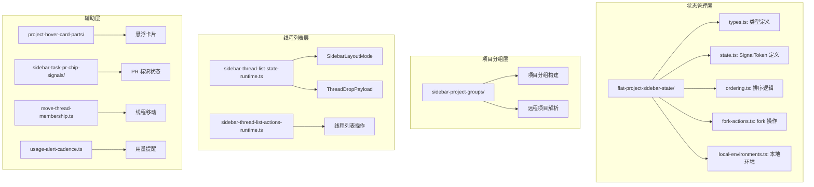
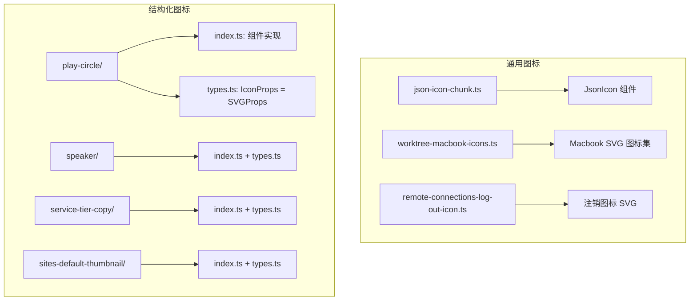
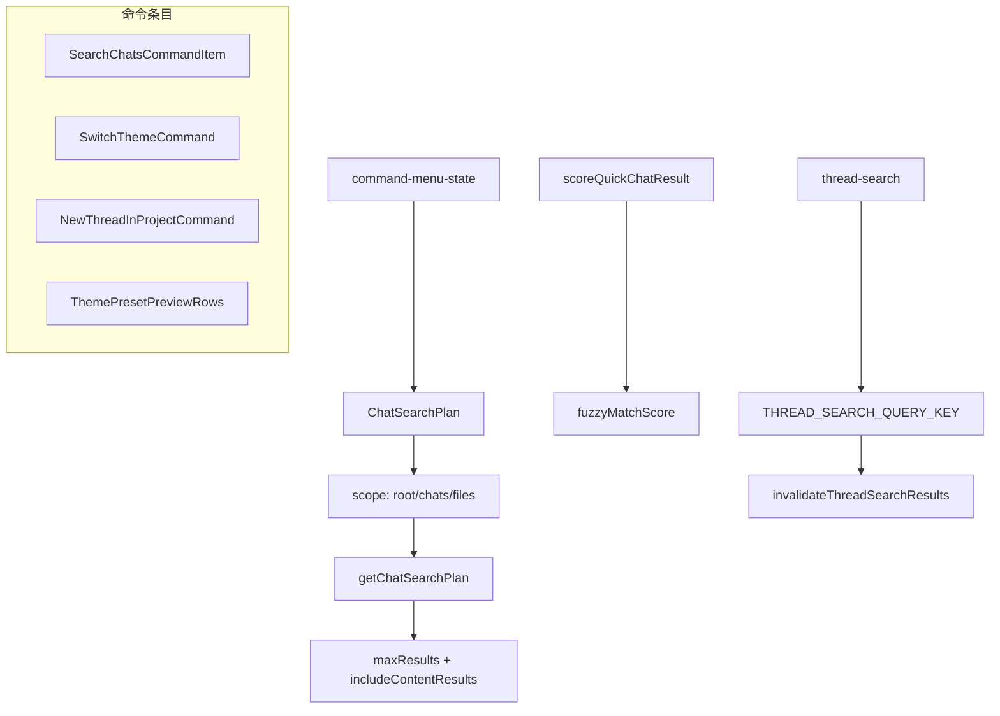

# 06-UI-Framework：UI 组件、侧边栏、主题与界面系统

## 概述

Codex 的 UI 框架层提供应用所需的所有通用组件、布局系统和视觉基础设施。涵盖通用组件库（`src/ui/`）、侧边栏系统（`src/sidebar/`）、主题系统（`src/themes/`）、图标系统（`src/icons/`）、动画系统（`src/animations/`）、命令菜单（`src/command-menu/`）、通知系统（`src/notifications/` + `src/inbox/`）以及首页（`src/home/`）、图片侧面板（`src/image-side-panel/`）、热键窗口（`src/hotkey-window/`）等应用界面。Markdown 渲染系统嵌入在会话系统内。

---

## 1. 通用 UI 组件库

### 1.1 SectionedPage（分段页面布局）

[**src/ui/sectioned-page/**](O:/work_space/github.com/@zhzluke96/decode-codex/src/ui/sectioned-page/) 提供可导航的分段页面布局，适用于设置页面等长表单场景。

**核心类型**（`types.ts`）：
- `SectionedPageNavOrientation` — `vertical` | `horizontal`
- `SectionedPageNavSection` — `{ id, title }`
- `SectionedPageProps` — 完整属性集：
  - `navSections` — 导航段列表
  - `navOrientation` — 导航方向
  - `header` / `navAccessory` / `navFooter` — 头部和导航区域
  - `contentInnerClassName` / `disableScrollFade` — 样式控制
  - `onSelectNavSection` — 导航选择回调
  - `showNav` — 是否显示导航
- `SectionedPageSectionProps` — 段落属性：`id`、`title`、`action`、`stickyHeader`、`showDivider`
- `SectionRegistry` — `Record<string, HTMLElement | null>` 段注册表
- `SectionRegistryContextValue` — React Context 值，提供 `setSectionElement` 方法

**实现**：
- `index.ts` — 导出 `SectionedPage`、`SectionedPageSection` 和类型
- `navigation-state.ts` — 导航状态管理
- `section-registry.ts` — 段注册表实现，支持 IntersectionObserver 驱动的自动高亮

### 1.2 Tooltip B（工具提示）

[**src/ui/tooltip-b/**](O:/work_space/github.com/@zhzluke96/decode-codex/src/ui/tooltip-b/) 是一个完善的 tooltip 系统，支持多种变体和交互模式。

**类型系统**（`types.ts`）：
- `TooltipSide`: `top` | `right` | `bottom` | `left`
- `TooltipAlign`: `start` | `center` | `end`
- `TooltipVariant`: `tooltip` | `rich` | `unstyled`
- `TooltipOpenWhen`: `always` | `trigger-overflows`（当 trigger 溢出时始终显示）
- `TooltipProviderProps` — 全局延迟配置（`delayDuration`、`skipDelayDuration`）
- `TooltipContextValue` — 全局上下文：`activeTooltipId`、`activeTooltipVariant`、`skipDelayActive`、`isHoverOpenBlocked`、`setHoverHandoffLockTooltipId` 等
- `TooltipProps` — 丰富属性：`tooltipContent`、`shortcut`、`disabled`、`delayDuration`、`sideOffset`、`interactive`、`portalContainer`、`triggerAsChild`、`positioningElement`、`closeOnTriggerBlur`、`getDelayDuration`、`ignoreHoverHandoffLock` 等
- `TooltipContentProps` — 内容属性：`placementSideRef`、`referenceElementRef`、`maxWidth` 等
- `TooltipShortcutProps` — 快捷键标签显示（`keysLabel` + `variant`）

**几何计算**（`geometry.ts`）：
- `trackSafePointerArea` — 追踪 tooltip 与 trigger 之间的"安全三角形区域"。当鼠标在此三角形内移动时，tooltip 不会关闭。三角形顶点：pointer start、destination 矩形两个扩展角点。
- `floatingPlacement(side, align)` — 将 side/align 转换为 Floating UI placement 格式（如 `top-start`、`bottom-end`）
- `sideFromPlacement(placement)` — 从 placement 提取 side
- `oppositeSide(side)` — 返回相反侧（top <-> bottom, left <-> right）
- 三角形碰撞检测使用叉积法（`triangleSide` + `isPointInsideTriangle`）

这种设计解决了 tooltip 常见的问题：当用户将鼠标从 trigger 移动到 tooltip 时，如果路径经过空隙，tooltip 不会意外关闭。

### 1.3 Dropdown（下拉菜单）

[**src/ui/dropdown/**](O:/work_space/github.com/@zhzluke96/decode-codex/src/ui/dropdown/) 提供多风格下拉菜单：

**类型**（`types.ts`）：
- `DropdownSurface`: `bare` | `menu` | `panel`（面板模式有毛玻璃效果）
- `DropdownContentWidth`: `icon`(120px) / `xs`(160px) / `sm`(180px) / `menuNarrow`(w-52) / `menu`(220px) / `menuFixed`(220px) / `menuBounded`(200-320px) / `menuWide`(240px) / `sidebar`(172-240px) / `workspace`(260px) / `panel`(280px) / `panelWide`(360px)
- `DropdownContentMaxHeight`: `list`(250px) / `tall`(350px)
- `DropdownIconSize`: `xs` / `sm` / `md`
- `DropdownTooltipProps` — trigger tooltip 配置

样式通过 `getSurfaceClassName`、`getContentWidthClassName`、`getContentMaxHeightClassName` 返回 Tailwind 类名。

### 1.4 Slash Command Item

[**src/ui/slash-command-item/**](O:/work_space/github.com/@zhzluke96/decode-codex/src/ui/slash-command-item/) 提供斜杠命令的渲染支持：
- `highlight.ts` — 关键词高亮逻辑
- `git-root.ts` — Git 根路径解析，用于命令的相对路径显示
- `types.ts` — 命令条目类型定义

### 1.5 其他 UI 组件

| 文件 | 路径 | 功能 |
|------|------|------|
| artifact-tab-runtime.ts | [src/ui/artifact-tab-runtime.ts](O:/work_space/github.com/@zhzluke96/decode-codex/src/ui/artifact-tab-runtime.ts) | 产物标签页运行时，`artifactRouteScope` + fallback conversation ID 管理 |
| conversation-starter-card-current.ts | [src/ui/conversation-starter-card-current.ts](O:/work_space/github.com/@zhzluke96/decode-codex/src/ui/conversation-starter-card-current.ts) | 对话起始卡片（ConversationStarterCard + ConversationStarterIcon） |
| thread-resource-card-runtime.ts | [src/ui/thread-resource-card-runtime.ts](O:/work_space/github.com/@zhzluke96/decode-codex/src/ui/thread-resource-card-runtime.ts) | 线程资源卡片组件 |
| code-snippet/index.tsx | [src/ui/code-snippet/index.tsx](O:/work_space/github.com/@zhzluke96/decode-codex/src/ui/code-snippet/index.tsx) | 代码片段展示组件（含语法高亮） |
| pdb-preview/ | [src/ui/pdb-preview/](O:/work_space/github.com/@zhzluke96/decode-codex/src/ui/pdb-preview/) | PDB/Python 调试器预览，含 parser + viewer + types |
| dialog-layout/ | [src/ui/dialog-layout/](O:/work_space/github.com/@zhzluke96/decode-codex/src/ui/dialog-layout/) | 对话框布局组件 |

---

## 2. 侧边栏系统

### 2.1 架构概览

`src/sidebar/` 实现 Codex 左侧项目侧边栏，采用"扁平项目侧边栏"（Flat Project Sidebar）模型替代传统的树形结构。



### 2.2 Flat Project Sidebar State

[**src/sidebar/flat-project-sidebar-state/**](O:/work_space/github.com/@zhzluke96/decode-codex/src/sidebar/flat-project-sidebar-state/) 是侧边栏的核心状态管理模块。

**核心类型**（`types.ts`）：
- `SidebarSortMode`: `priority` | `manual` | `updated_at` — 排序方式
- `SidebarMode`: `connection`（按连接分组） | `list`（扁平列表） | `project`（按项目分组） — 布局模式
- `SidebarAttentionState`: `waiting` | `unread` | `active` | `idle` — 线程关注度状态
- `SidebarTask` — 三种任务类型联合：
  - `SidebarLocalTask` — 本地对话任务（含 createdAt、updatedAt、workspaceKind）
  - `SidebarRemoteTask` — 远程任务（含 created_at、updated_at）
  - `SidebarPendingWorktreeTask` — 待处理 worktree 任务
- `SidebarTaskItem` — `{ task, isPinned, recencyAt }`
- `SidebarThreadOrder` — `{ sortKey, threadIds[] }`
- `SidebarProjectGroup` — `{ projectId, projectUpdatedAt?, threadKeys[] }`
- `SidebarConnectionGroup` — `{ id, threadKeys[] }`
- `FlatProjectSidebarPreferences` — `{ chatSortMode, initialized, mode, projectSortMode }`
- `FlatProjectSidebarSnapshot` — 完整快照：
  - `connectionGroups` / `projectGroups` / `projectlessThreadKeys` / `shortcutThreadKeys`
  - `navigationThreadKeys` / `pinnedProjectThreadKeys`
  - `threadKeys` / `threadAttentionStateByKey` / `threadRecencyAtByKey`
  - `projectCount` / `hasLoadedProjectSources` / `isWorkspaceRootOptionsLoading`
- `LocalEnvironmentConfig` / `LocalEnvironmentSelectionState` — 本地环境配置
- `ForkConversationStore` — fork 操作所需的 store 类型

**SignalToken 系统**（`state.ts`）：
使用泛型 `SignalToken<T>` 模式，每种信号有唯一 key 和默认值：

```typescript
const sidebarChatOrderSignal = createSignalToken<SidebarThreadOrder | undefined>(
  "codex-sidebar-chat-order-v1", undefined
);
const flatProjectSidebarPreferencesSignal = createSignalToken<FlatProjectSidebarPreferences>(
  "flat-project-sidebar-preferences-v1",
  DEFAULT_FLAT_PROJECT_SIDEBAR_PREFERENCES  // { chatSortMode: "priority", mode: "project", ... }
);
const flatProjectSidebarSnapshotSignal = createSignalToken<FlatProjectSidebarSnapshot>(
  "flat-project-sidebar-snapshot", { ... 首次加载状态 }
);
const activeSidebarProjectRootSignal = createSignalToken<string | null>(
  "flat-project-sidebar-active-project-root", null
);
const flatProjectSidebarModeSignal = createSignalToken<SidebarMode>(
  "flat-project-sidebar-mode", "project"
);
```

**排序与本地环境**：
- `ordering.ts` — 根据 `sidebarChatOrderSignal` 和 `sidebarProjectSortModeOverrideSignal` 计算排序
- `local-environments.ts` — 按 workspace key 管理本地环境选择状态

### 2.3 项目分组

[**src/sidebar/sidebar-project-groups/**](O:/work_space/github.com/@zhzluke96/decode-codex/src/sidebar/sidebar-project-groups/) 构建侧边栏项目分组：

**SidebarProjectGroup 字段**：
- `projectId` / `projectKind`（local/remote）/ `hostId`
- `label` — 显示标签
- `path` — 文件系统路径
- `isCodexWorktree` — 是否为 Codex worktree
- `repositoryData` — `{ ownerRepo, repoPath, rootFolder }`
- `cloudEnvironment` — 云环境信息
- `threadKeys` — 归属线程键列表

构建逻辑：
1. 解析工作区根路径
2. 对每个项目，读取 Git origin URL 解析 owner/repo
3. 识别是否为 Codex worktree（`isCodexWorktreePath`）
4. 匹配远程项目（`findRemoteProjectByPath`）
5. 按 sort mode 排序输出

### 2.4 线程列表状态

[**src/sidebar/sidebar-thread-list-state-runtime.ts**](O:/work_space/github.com/@zhzluke96/decode-codex/src/sidebar/sidebar-thread-list-state-runtime.ts) 管理线程列表的运行时状态：

- `SidebarLayoutMode`: connection / list / project 三种布局模式
- `SidebarPreferences`: 排序和布局偏好
- `SidebarItem`: 线程列表中的条目
- `ThreadDropPayload`: 拖拽事件 payload（`{ threadId, beforeThreadId, sourceContainerId, targetContainerId }`）
- `ThreadProjectAssignment`: 线程项目分配（`{ projectId, projectKind, hostId, path }`）

### 2.5 其他侧边栏文件

- [**move-thread-membership.ts**](O:/work_space/github.com/@zhzluke96/decode-codex/src/sidebar/move-thread-membership.ts) — 跨项目移动线程的成员关系管理
- [**open-right-sidebar-panel.ts**](O:/work_space/github.com/@zhzluke96/decode-codex/src/sidebar/open-right-sidebar-panel.ts) — 右侧面板打开逻辑
- [**product-mode-messages.ts**](O:/work_space/github.com/@zhzluke96/decode-codex/src/sidebar/product-mode-messages.ts) — 产品模式相关的消息/提示
- [**sidebar-thread-list-actions-runtime.ts**](O:/work_space/github.com/@zhzluke96/decode-codex/src/sidebar/sidebar-thread-list-actions-runtime.ts) — 线程列表操作运行时
- [**sidebar-task-pr-chip-signals/**](O:/work_space/github.com/@zhzluke96/decode-codex/src/sidebar/sidebar-task-pr-chip-signals/) — PR（Pull Request）标识信号管理，含 feature gate 控制
- [**project-hover-card-parts/**](O:/work_space/github.com/@zhzluke96/decode-codex/src/sidebar/project-hover-card-parts/) — 项目悬浮卡片组件，显示远程连接状态和详情
- [**usage-alert-cadence.ts**](O:/work_space/github.com/@zhzluke96/decode-codex/src/sidebar/usage-alert-cadence.ts) — 用量提醒频率控制

---

## 3. 主题系统

### 3.1 主题列表

[**src/themes/**](O:/work_space/github.com/@zhzluke96/decode-codex/src/themes/) 包含 13 个 VS Code 风格主题：

| 文件 | 主题名 | 类型 |
|------|--------|------|
| absolutely-dark.ts | Absolutely Dark | 深色 |
| absolutely-light.ts | Absolutely Light | 浅色 |
| linear-dark.ts | Linear Dark | 深色 |
| linear-light.ts | Linear Light | 浅色 |
| lobster-dark.ts | Lobster Dark | 深色 |
| matrix-dark.ts | Matrix Dark | 深色 |
| notion-dark.ts | Notion Dark | 深色 |
| notion-light.ts | Notion Light | 浅色 |
| proof-light.ts | Proof Light | 浅色 |
| sentry-dark.ts | Sentry Dark | 深色 |
| temple-dark.ts | Temple Dark | 深色 |
| vercel-dark.ts | Vercel Dark | 深色 |
| vercel-light.ts | Vercel Light | 浅色 |

### 3.2 主题结构

每个主题文件导出四个部分：

```typescript
// 示例：Absolutely Dark
export const bg = "#2d2d2b";  // 编辑器背景色

export const colors = {
  "activityBar.activeBorder": "#cc7d5e",
  "activityBar.background": "#373735",
  "activityBarBadge.background": "#cc7d5e",
  "button.background": "#cc7d5e",
  "editor.background": "#2d2d2b",
  "editor.foreground": "#f9f9f7",
  "editorCursor.foreground": "#cc7d5e",
  "editorGroupHeader.tabsBackground": "#373735",
  "focusBorder": "#cc7d5e",
  "foreground": "#f9f9f7",
  "panel.background": "#373735",
  "sideBar.background": "#373735",
  "sideBar.foreground": "#f9f9f7",
  "sideBarTitle.foreground": "#f9f9f7",
  "textLink.foreground": "#cc7d5e",
  // VS Code Theme API 兼容的颜色键，约 15-20 个
};

export const name = "Absolutely Dark";

export const settings = [
  { scope: ["comment", "punctuation.definition.comment"], settings: { foreground: "#b2b2b0" } },
  { scope: ["string", "constant.other.symbol"], settings: { foreground: "#00c853" } },
  { scope: ["constant.numeric", "constant.language.boolean"], settings: { foreground: "#ff5f38" } },
  { scope: ["keyword", "keyword.control", "storage"], settings: { foreground: "#ff5f38" } },
  { scope: ["entity.name.type", "support.class"], settings: { foreground: "#ff5f38" } },
  { scope: ["variable", "support.variable"], settings: { foreground: "#00c853" } },
  // ... TextMate scope 列表
];
```

一些主题还导出 `chromeTheme`（如 Linear Dark）：
```typescript
export const chromeTheme = {
  accent: "#606acc",
  fonts: { ui: "Inter" },
  ink: "#e3e4e6",
  opaqueWindows: true,
  semanticColors: {
    diffAdded: "#69c967",
    diffRemoved: "#ff7e78",
    skill: "#c2a1ff",
  },
  surface: "#0f0f11",
};
```

Notion Dark 的 `chromeTheme` 较简单，仅设置 `opaqueWindows: true`，fonts 为 null。

### 3.3 设计特点

- 遵循 VS Code Theme API 规范，与 VS Code 颜色 token 兼容
- TextMate 语法作用域覆盖：comment、string、constant.numeric、keyword、entity.name.type、variable、support、markup 等
- Chrome 主题（`chromeTheme`）控制应用窗口级 UI 颜色（accent、surface、ink、fonts）
- 语义颜色（`semanticColors`）覆盖 diff added/removed 和 skills 标签
- 深浅色系平衡：9 个深色 + 4 个浅色

---

## 4. 图标系统

### 4.1 架构

[**src/icons/**](O:/work_space/github.com/@zhzluke96/decode-codex/src/icons/) 使用 React SVG 组件模式，每个图标为独立模块。



结构化图标遵循 `{icon-name}/index.ts + types.ts` 模式：
- `types.ts` — 导出 `IconProps` 类型（`SVGProps<SVGSVGElement>`）
- `index.ts` — 导出 SVG 组件

通用图标直接导出 SVG React 组件和 `init*Chunk` 初始化函数。

---

## 5. 动画系统

### 5.1 Lottie 动画

[**src/animations/**](O:/work_space/github.com/@zhzluke96/decode-codex/src/animations/) 包含 15 个 Lottie JSON 动画，用于 Agent 活动和状态的可视化反馈。

| 文件 | 场景 | 尺寸 |
|------|------|------|
| `browsing-animation.ts` | 浏览器工具激活 | - |
| `searching-animation.ts` | 文件/代码搜索 | - |
| `code-searching-icon.ts` | 代码搜索图标动画 | - |
| `analyze-image-animation.ts` | 图片分析 | - |
| `list-files-animation.ts` | 文件列表浏览 | - |
| `local-context-animation.ts` | 本地上下文加载 | - |
| `hello.ts` | Codex 问候 | 500x500, 6s, 60fps |
| `automation.ts` | 自动化任务 | 2160x2160, 361 frames |
| `codex-looking-around.ts` | Agent "环顾" | - |
| `codex-happy-small.ts` | 积极反馈 | - |
| `internal-knowledge-icon.ts` | 内部知识 | - |
| `web-search-icon.ts` | 网络搜索 | - |
| `to-do-animation.ts` | 计划/待办 | - |
| `loader.ts` | 通用加载 | - |

每个动画导出标准 Lottie JSON 对象：
```typescript
export const hello = {
  v: "5.7.0",    // Lottie 版本
  ip: 0,         // 起始帧
  op: 373,       // 结束帧
  fr: 60,        // 帧率
  w: 500, h: 500,// 画布尺寸
  nm: "Codex_Hello_SL_b_v01_Lottie_6sec",
  assets: [],    // 资产列表
  layers: [...], // 动画图层
};
```

各层包含：ind（索引）、ty（类型：4=shape, 1=solid）、nm（名称）、ks（变换：position/scale/rotation/opacity）、shapes/ef（矢量形状和效果）。

---

## 6. 命令菜单

### 6.1 架构

[**src/command-menu/**](O:/work_space/github.com/@zhzluke96/decode-codex/src/command-menu/) 实现 Command+K 全局搜索/命令菜单。



### 6.2 搜索与评分

**quick-chat-result.ts**：
- `QUICK_CHAT_RESULT_ID_PREFIX`: `command-menu-quick-chat-result:`
- `ChatSearchScope`: `root` / `chats` / `files`
- `getChatSearchPlan(scope, query)` — 根据 scope 和查询长度返回搜索计划：
  - `root`: 最少 2 字符触发，3 字符以上包含内容搜索，最多 9 条结果
  - `chats`: 任意长度触发内容搜索，最多 9 条
  - `files`: 返回 null（不做快速搜索）
- `scoreQuickChatResult(value, search, keywords?)` — 基于 `fuzzyMatchScore` 的模糊匹配排序

**thread-search.ts**：
- `THREAD_SEARCH_QUERY_KEY`: `command-menu-thread-search`
- `invalidateThreadSearchResults(queryClient)` — 使缓存失效

### 6.3 命令条目

通过 `index.ts` 导出：
- `SearchChatsCommandItem` / `NoChatMatchesItem` — 搜索对话
- `SwitchThemeCommand` — 切换主题命令
- `ThemePresetPreviewRows` — 主题预览行（带 `THEME_PREVIEW_SEED_QUERY_KEY`）
- `NewThreadInProjectCommand` — 在指定项目中新建线程（含 `CommandMenuWorkspaceGroup`）
- `dispatchChatSearchCommandMenu` — 分发搜索命令

---

## 7. 通知系统

### 7.1 桌面通知服务

[**src/notifications/**](O:/work_space/github.com/@zhzluke96/decode-codex/src/notifications/) 实现三个后台服务：

#### DesktopNotificationsService（`desktop-notifications.ts`）

监听 `ConversationHostService` 的三类事件：

1. **turnCompleted** — turn 完成时触发：
   - 根据 `TurnMode` 设置决定行为：`off`（不通知）/ `always`（总通知）/ `unfocused`（仅窗口未聚焦时）
   - 检查对话是否静音（`isConversationMuted`）
   - 如果窗口已聚焦且 mode=unfocused 则跳过
   - 点击通知导航到对应对话

2. **approvalRequest** — 审批请求通知：
   - 检查 `pendingApprovalsAtom`
   - 点击打开审批面板

3. **userInputRequest** — 用户输入请求通知：
   - 点击聚焦到输入区域

远程任务完成通过 `useRemoteTasksQuery` 驱动，对已关闭的对话发送"完成了一个 turn"通知。

#### ElectronAppBadge（`app-badge.ts`）

- 订阅 `appBadgeCountAtom`
- 通过 `vscodeApiF.dispatchMessage("electron-set-badge-count", { count })` 设置 OS 徽章
- 简单、专注、无 UI 渲染

#### PowerSaveBlockerController（`power-save-blocker.ts`）

- 两个设置控制：`preventSleepWhileRunning` + `keepRemoteControlAwakeWhilePluggedIn`
- 订阅 `hasRunningTurnAtom` 和 `isHostPluggedInAtom`
- 通过 `vscodeApiF.dispatchMessage("power-save-blocker-set", ...)` 通知 Electron 主进程
- 用于阻止系统休眠，防止长时间运行的任务被中断

### 7.2 收件箱自动化时间格式

[**src/inbox/automation-next-run-format.ts**](O:/work_space/github.com/@zhzluke96/decode-codex/src/inbox/automation-next-run-format.ts) 格式化自动化任务的运行时间：

- `formatRelativeRunTime` — 相对时间格式化：
  - 今天：`"Today at {time}"`
  - 明天：`"Tomorrow at {time}"`
  - 本周内：`"{Weekday} at {time}"`
  - 更远：`"MMM D, YYYY at {time}"`
- 相对日期窗口：7 天（`RELATIVE_DATE_WINDOW_DAYS`）
- 使用 `differenceInCalendarDays` 比较日期（忽略时间部分）

---

## 8. 首页

### 8.1 主页组件

[**src/home/**](O:/work_space/github.com/@zhzluke96/decode-codex/src/home/) 实现 Codex 首页。

**页面模块**（`home-page/index.ts` 导出）：
- `get-plus-button.ts` — "+" 新建按钮
- `home-electron-surface.ts` — Electron 桌面端表面
- `home-new-chat-page.ts` — 新聊天页面
- `home-page-body.ts` — 页面主体（用例卡片 + 最近对话）
- `home-switch-workspace-command.ts` — 切换工作区命令

**使用案例数据**（`home-use-cases-data.ts`）：
预定义的用例模板数组，每个包含：
- `id` — 唯一标识（如 `snake-game`、`one-page-pdf`、`create-plan`）
- `promptMessage` — 预填充提示文本，结构化为 Scope & constraints + Implementation plan + Deliverables
- `iconName` — 对应图标名称
- `mode` — worktree 或 local
- `initialCollaborationMode` — 可选，如 `plan` 模式用于先规划后执行

**滚动容器上下文**（`home-scroll-container-context.ts`）：
```typescript
export const HomeScrollContainerContext = createContext<HTMLElement | null>(null);
```
首页滚动容器元素的 React Context，提供给 portal、overlay 等子组件锚定使用。

---

## 9. 图片侧面板

### 9.1 功能

[**src/image-side-panel/**](O:/work_space/github.com/@zhzluke96/decode-codex/src/image-side-panel/) 实现图片预览和管理侧面板。

**核心接口**（`image-side-panel-types.ts`）：
```typescript
interface ImageSidePanelProps {
  alt: string;         // 替代文本
  attachmentSrc: string;// 附件源路径
  referrerPolicy?: HTMLAttributeReferrerPolicy;
  src: string;         // 图片源
  downloadSrc?: string; // 下载源（可选）
}

interface GeneratedImage {
  id: string;
  alt: string;
  src: string;
  previewSrc: string;
  tabTitle?: string;
}
```

**主要功能模块**：

| 文件 | 功能 |
|------|------|
| [image-preview-tab-runtime.ts](O:/work_space/github.com/@zhzluke96/decode-codex/src/image-side-panel/image-preview-tab-runtime.ts) | 预览标签页控制器，支持右侧/底部面板 |
| [image-asset-cache.ts](O:/work_space/github.com/@zhzluke96/decode-codex/src/image-side-panel/image-asset-cache.ts) | 图片资源缓存 |
| [image-side-panel-download.ts](O:/work_space/github.com/@zhzluke96/decode-codex/src/image-side-panel/image-side-panel-download.ts) | 下载文件名推导（`deriveDownloadFileName`） |
| [download-image.ts](O:/work_space/github.com/@zhzluke96/decode-codex/src/image-side-panel/download-image.ts) | 图片下载实现 |
| [upload-image.ts](O:/work_space/github.com/@zhzluke96/decode-codex/src/image-side-panel/upload-image.ts) | 图片上传 |
| [image-resize-options.ts](O:/work_space/github.com/@zhzluke96/decode-codex/src/image-side-panel/image-resize-options.ts) | 缩放选项 |
| [image-resize-prompt.ts](O:/work_space/github.com/@zhzluke96/decode-codex/src/image-side-panel/image-resize-prompt.ts) | 缩放提示 |
| [image-comment-draft-store.ts](O:/work_space/github.com/@zhzluke96/decode-codex/src/image-side-panel/image-comment-draft-store.ts) | 图片标注草稿存储 |
| [paged-annotation-overlay-constants.ts](O:/work_space/github.com/@zhzluke96/decode-codex/src/image-side-panel/paged-annotation-overlay-constants.ts) | 分页标注覆盖层常量 |
| [paged-annotation-overlay-geometry.ts](O:/work_space/github.com/@zhzluke96/decode-codex/src/image-side-panel/paged-annotation-overlay-geometry.ts) | 标注覆盖层几何计算 |
| [start-composer-turn.ts](O:/work_space/github.com/@zhzluke96/decode-codex/src/image-side-panel/start-composer-turn.ts) | 从图片面板启动 composer turn |
| [use-image-preview-sources.ts](O:/work_space/github.com/@zhzluke96/decode-codex/src/image-side-panel/use-image-preview-sources.ts) | 预览源管理 hook |

**预览标签页控制**：
- 使用 `AppShellTabController`（`rightAppShellTabController` / `bottomAppShellTabController`）
- `findPreviewTabPanelSide(store, tabId)` — 在 right 和 bottom 面板中查找标签页
- `focusPreviewTabComposer(store)` — 聚焦右侧面板 composer

---

## 10. Markdown 渲染系统

[**src/markdown/**](O:/work_space/github.com/@zhzluke96/decode-codex/src/markdown/) 目录没有找到 .ts 文件。Markdown 渲染能力嵌入在 `src/conversations/` 模块中：

- `conversation-markdown.ts` — 对话 Markdown 导出器（外部共享格式）
- `conversation-markdown-parts/markdown-format.ts` — Markdown 格式化工具（代码块、元数据块、折叠块等）
- `extract-markdown-title.ts` — 从 Markdown 内容提取标题
- `pull-request-description-markdown-parser.ts` / `pull-request-description-markdown-renderer.ts` — PR 描述解析和渲染

Markdown 渲染在 UI 层通过 `code-snippet/` 组件提供语法高亮。

---

## 11. 设计模式总结

1. **组件-类型分离** — 通用组件遵循 `types.ts`（类型定义）+ `index.ts`（实现）分离模式，如 tooltip-b、dropdown、sectioned-page
2. **JSX + Tailwind 响应式类名** — 下拉菜单使用 Tailwind 类名系统（`rounded-2xl p-4 shadow-2xl backdrop-blur-lg`），支持暗黑模式
3. **Lottie 动画数据驱动** — Agent 可视化使用标准 Lottie JSON，与渲染引擎解耦
4. **SignalToken 模式** — 侧边栏使用泛型 `SignalToken<T>` 定义类型安全的状态信号
5. **VS Code Theme API 兼容** — 主题遵循 VS Code 颜色键和 TextMate scope 规范，可直接映射到代码编辑器
6. **React Context 传递** — 全局上下文如 HomeScrollContainerContext、TooltipContextValue 实现跨组件通信
7. **扁平化侧边栏模型** — Flat Project Sidebar 替代树形结构，通过 project/connection/list 三种模式切换视图
8. **多目标通知系统** — 桌面通知 + Electron 徽章 + 电源管理的三层后台服务
