# 07-Dev-Tools-Integrations

**card id:** e7978b22  
**更新日期:** 2026-07-15

本文档覆盖 Codex 应用中所有开发者工具与集成子系统。每个系统独立分析其目录结构、核心抽象、数据流和设计模式。代码均从反编译的 webview 产物恢复，源码位于 `src/` 下。所有系统共享同一套信号/状态基础设施（详见 03-runtime-signal-system.md 和 04-state-infrastructure.md）。

---

## 目录

1. [终端系统](#1-终端系统)
2. [内置浏览器](#2-内置浏览器)
3. [Git 集成](#3-git-集成)
4. [GitHub 集成](#4-github-集成)
5. [搜索/查找系统](#5-搜索查找系统)
6. [下载系统](#6-下载系统)
7. [Sites 系统](#7-sites-系统)
8. [Skills 系统](#8-skills-系统)
9. [自动化系统](#9-自动化系统)
10. [工作区与 Worktree 系统](#10-工作区与-worktree-系统)
11. [应用生成 (AppGen)](#11-应用生成-appgen)
12. [协作系统](#12-协作系统)
13. [远程连接](#13-远程连接)
14. [PR 请求系统](#14-pr-请求系统)
15. [代码审查系统](#15-代码审查系统)
16. [新用户引导](#16-新用户引导)
17. [调试工具](#17-调试工具)
18. [移动端](#18-移动端)
19. [应用服务](#19-应用服务)
20. [用户资料](#20-用户资料)
21. [跨系统设计与模式总结](#21-跨系统设计与模式总结)

---

## 1. 终端系统

### 目录结构

```
src/terminal/
├── ansi-output.tsx                            # ANSI 转义序列渲染
├── terminal-error-fallback.tsx                # 错误边界回退 UI
├── terminal-key-event-handler.ts              # 键盘事件处理器
├── terminal-link-handler.ts                   # 终端链接处理器 (Ctrl+Click)
├── terminal-panel-routing.ts                  # 面板位置路由 (底部/右侧)
├── terminal-panel-signals.ts                  # 面板状态派生信号
├── terminal-panel-tabs.ts                     # 面板 Tab 操作 (新建/切换/关闭)
├── terminal-panel-tabs-runtime.tsx            # Tab 运行时
├── terminal-panel-tabs-subscription-runtime.ts # Tab 订阅运行时
├── terminal-panel-tabs-sync-runtime.tsx       # Tab 同步运行时
├── terminal-panel-target-runtime.ts           # 面板目标解析
├── terminal-panel.tsx                         # 核心终端面板组件
├── terminal-session-tab.tsx                   # 会话 Tab 组件
├── terminal-tab-title.ts                      # Tab 标题工具
├── terminal-view-utils.ts                     # 视图工具 (主题/字体/缩放)
└── use-conversation-terminal-snapshot.ts      # 会话快照 Hook
```

### 核心抽象

终端系统的核心组件是 `TerminalPanel`（[src/terminal/terminal-panel.tsx](/src/terminal/terminal-panel.tsx)）。它包装了一个 **xterm.js** 实例，配合三个 addon：

- `ClipboardAddon` — 剪贴板操作
- `FitAddon` — 自动适应容器大小
- `WebLinksAddon` — 可点击链接

终端实例通过 `terminalSessionManager` 与宿主进程通信，这是一个桥接对象，将终端的 I/O、标题变更、resize 事件传递到 VSCode 扩展宿主。

### 架构图

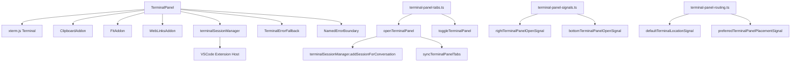

### 关键设计决策

1. **信号驱动的面板定位** — `terminal-panel-routing.ts` 通过 `createComputedSignal` 计算用户偏好的终端位置（底部/右侧）。信号会自动根据 `bottomPanelLauncherVisibleSignal` 降级到右侧面板。
2. **Tab ID 前缀约定** — 终端 tab 使用 `terminal:` 前缀标识 (`TERMINAL_TAB_ID_PREFIX`)，所有面板路由、切换和查询都基于这个前缀做匹配。
3. **主题实时同步** — 终端的色彩主题通过 `readTerminalThemeFromCss()` 从 DOM 元素 CSS 变量读取，当 `resolvedChromeTheme` 或 `colorScheme` 变化时自动更新。
4. **缩放感知** — `patchTerminalMouseCoordsForZoom` 在鼠标坐标上报前根据窗口缩放比修正，确保点击位置准确。
5. **Git 变更检查** — 每次 Enter 键按下时调用 `requestGitIndexChangeCheck()`，与 Git 集成联动。
6. **惰性初始化 chunk** — 每个模块功能通过 `initTerminalPanelSignalsChunk()` / `initTerminalPanelRoutingChunk()` 等函数做一次性子模块初始化，由 `once()` 包装保证只执行一次。

---

## 2. 内置浏览器

### 目录结构

```
src/browser/
├── browser-sidebar.tsx                        # 主浏览器侧边栏组件
├── browser-sidebar-view.tsx                   # 视图层分离
├── browser-sidebar-model.ts                   # 数据模型
├── browser-sidebar-state.ts                   # 状态定义
├── browser-sidebar-state-runtime.ts           # 状态运行时
├── sidebar-manager/                           # 浏览器管理器
├── sidebar-webview.tsx                        # WebView 组件
├── browser-sidebar-host-utils.ts             # 宿主工具 (边界/缩放/焦点模式)
├── browser-sidebar-focus.ts                   # 焦点管理
├── browser-sidebar-zoom-controller.tsx        # 缩放控制器
├── browser-sidebar-zoom-banner.tsx            # 缩放提示条
├── browser-agent-cursor.tsx                   # 代理光标覆盖层
├── browser-agent-cursor-types.ts              # 光标类型定义
├── browser-agent-cursor-bezier-path.ts        # 光标贝塞尔曲线路径
├── browser-annotate-button.tsx                # 标注模式按钮
├── browser-annotation-takeover-toolbar.tsx    # 标注接管工具栏
├── browser-comment-*.tsx                      # 浏览器评论/标注系统 (10+ 文件)
├── browser-device-toolbar.tsx                 # 设备仿真工具栏
├── browser-device-toolbar-runtime             # 仿真状态运行时
├── browser-address-bar-autocomplete.tsx       # 地址栏自动完成
├── browser-address-security-indicator.tsx     # 安全指示器
├── browser-settings-runtime.tsx               # 设置运行时
├── browser-screenshot-button.tsx              # 截图按钮
├── browser-downloads-*.tsx                    # 下载集成
├── browser-profile-import-*.tsx               # 浏览器配置导入
├── browser-tab-*.ts                           # Tab 路由/ID 解析
├── browser-options-menu.tsx                   # 选项菜单
├── browser-coachmark-tooltip.tsx              # 新手引导提示
├── chrome-extension-*.tsx                     # Chrome 扩展头
├── use-browser-sidebar-*.ts                   # 副作用 Hooks (4 个)
├── web-search-favicon-icon.tsx                # 搜索图标
├── hidden-background-webview-host.tsx         # 隐藏 WebView
└── hidden-browser-use-webview-host.tsx        # 浏览器使用隐藏 WebView
```

### 核心架构

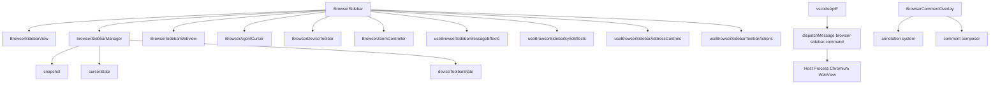

### 关键设计决策

1. **Managed WebView 模式** — 浏览器通过宿主进程管理 Chromium WebView 实例。`vscodeApiF.dispatchMessage("browser-sidebar-command", ...)` 发送命令到宿主，宿主操作真正的 WebView。
2. **Snapshot 模式** — `browserSidebarManager` 维护每个 conversation+tab 的状态快照。UI 通过 `React.useSyncExternalStore` 订阅快照变化，保证渲染一致性。
3. **代理光标 (Agent Cursor)** — AI 代理操作浏览器时，`BrowserAgentCursor` 组件渲染一个动画光标覆盖层模拟用户交互。光标移动使用贝塞尔曲线路径实现平滑动画。
4. **标注/评论系统** — 浏览器支持完整的评论和设计标注系统。`BrowserCommentOverlay` 渲染覆盖层，支持三种标注流程（注释/设计/自由模式），通过 `annotationFlowConfig` 配置。
5. **设备仿真** — `BrowserDeviceToolbar` 提供响应式设计预览，支持自定义分辨率、旋转和缩放。
6. **地址栏自动完成** — 基于 Chromium 内部 API 提供 URL 自动完成和搜索建议。
7. **多 Tab 支持** — `multiBrowserTabsEnabledAtom` 控制多 Tab 开关。`persistedTabsEnabled` 特性门控控制 Tab 持久化。
8. **浏览器配置文件导入** — `BrowserProfileImportNux` 引导用户从已安装的 Chrome/Edge 等浏览器导入配置（书签、密码、扩展）。

---

## 3. Git 集成

### 目录结构

```
src/git/
├── git-branch-switcher.tsx                    # 分支切换器入口
├── git-review-primitives.tsx                  # 审查原语入口
├── git-branch-switcher-parts/
│   ├── branch-dialogs.tsx                     # 分支操作对话框
│   ├── branch-dropdown.tsx                    # 分支下拉选择
│   ├── branch-helpers.ts                      # 辅助函数
│   ├── branch-mutations.ts                    # checkout/create 变更操作
│   ├── branch-name.ts                         # 分支名清洗
│   ├── branch-queries.ts                      # 分支查询 (最近分支/搜索)
│   ├── branch-query-shared.ts                 # 共享查询类型
│   ├── branch-search-query.ts                 # 分支搜索查询
│   ├── branch-status-queries.ts               # 状态查询 (未提交变更)
│   ├── constants.ts                           # 常量
│   ├── git-branch-switcher.tsx                # 分支切换器组件
│   ├── types.ts                               # 类型定义
│   └── branch-query-shared.ts                 # 共享查询
└── git-review-primitives/
    ├── action-popover-primitives.ts           # Git 仓库创建/初始化
    ├── diff-stats.ts                          # Diff 统计 (增删行)
    └── index.ts                               # 入口
```

### 架构图

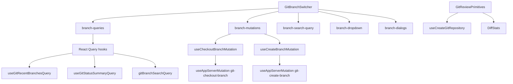

### 关键设计决策

1. **React Query 驱动** — Git 分支查询大量使用 `@tanstack/react-query`。`useGitRecentBranchesQuery` 和 `useGitStatusSummaryQuery` 提供分页和缓存。查询键包含 `cwd` 和 `hostConfig.id`，按工作目录隔离缓存。
2. **变更操作通过 App Server Mutation** — `useCheckoutBranchMutation` 和 `useCreateBranchMutation` 通过 `useAppServerMutation` 发送变更到后台。成功后在 `onSettled` 回调中调用 `updateGitMetadataCache` 更新 React Query 缓存的 Git 元数据，自动保持 UI 同步。
3. **分支名清洗** — `sanitizeGitBranchSearchInput` 确保分支名合法，移除非法字符，检查长度限制。
4. **Git 可用性检查** — `useGitAvailabilityQuery` 在执行变更前检查 Git 是否可用，提供操作前置条件校验。
5. **HostConfig 解耦** — 所有 Git 操作接受 `hostConfig` 参数，使 Git 系统可以在远程主机上执行，与远程连接系统天然集成。

---

## 4. GitHub 集成

### 目录结构

```
src/github/
├── gh-pull-request-status-query.ts            # PR 状态查询
├── git-config-value-current.ts                # Git 配置当前值
├── git-config-value-query-b-kg-flj-zw.tsx     # Git 配置值查询
├── git-current-branch-query.tsx               # 当前分支查询
├── git-root-query.ts                          # Git 根目录查询
├── git-submodule-paths-query.tsx              # Git 子模块路径查询
├── github-avatar-url.ts                       # GitHub 头像 URL
├── parse-owner-repo.ts                        # owner/repo 解析
├── pull-request-button-label.tsx              # PR 按钮标签
├── pull-request-checks-summary.tsx            # PR Checks 摘要
├── pull-request-fix-button.tsx                # PR 修复按钮
├── pull-request-status-utils.ts               # PR 状态工具
├── pull-request-status.tsx                    # PR 状态组件
├── use-git-default-branch.ts                  # 默认分支查询
├── use-is-pull-request-merge-helper-enabled.ts # PR 合并助手门控
├── diff-comments/
│   ├── diff-comments-by-conversation-signal.ts # Diff 评论信号
│   ├── set-diff-comments-for-conversation.ts  # 设置 Diff 评论
│   └── use-diff-comment-sources/              # Diff 评论来源
└── diff-view-mode/
    ├── diff-preferences-impl.ts               # Diff 偏好实现
    ├── diff-view-mode-impl.ts                 # Diff 视图模式实现
    ├── index.ts
    └── theme-colors-impl.ts / theme-registry-impl.ts
```

### 架构图

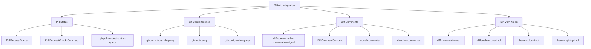

### 关键设计决策

1. **URI 解析模式** — `parse-owner-repo.ts` 从 Git 远程 URL 解析 `owner/repo`，使用正则匹配多种 URL 格式（HTTPS、SSH、GitHub CLI 的 `gh` 协议）。
2. **Diff 评论双源** — `use-diff-comment-sources` 支持两种评论来源：`model-comments`（模型生成的评论）和 `directive-comments`（用户指令中的 `::code-comment{}`）。运行时按需合并。
3. **Diff 视图模式系统** — `diff-view-mode` 提供可配置的 diff 视觉呈现，包括主题颜色注册表和偏好持久化。四种预设模式：`full`（完整）、`split`（分割）、`unified`（统一）、`minimap`（缩略图）。

---

## 5. 搜索/查找系统

### 目录结构

```
src/find/
├── dom-content-search.ts                      # DOM 内容搜索
├── diff-find-selectors.ts                     # Diff 搜索选择器
├── find-match-offsets.ts                      # 匹配偏移量计算
├── review-find-runtime.ts                     # 审查搜索运行时
├── thread-find-atoms.ts                       # 查找原子状态
├── thread-find-bar.tsx                        # 查找栏 UI
├── thread-find-domain.ts                      # 域名切换逻辑
├── thread-find-store.ts                       # 查找状态存储操作
├── dom-content-search/
│   ├── constants.ts                           # 搜索常量
│   ├── highlight.ts                           # 高亮渲染
│   ├── match-id.ts                            # 匹配 ID 生成
│   ├── mutation-refresh.ts                    # DOM 变更刷新
│   ├── roots.ts                               # 搜索根
│   └── types.ts                               # 搜索类型
└── thread-find-bar-parts/
    ├── browser-commands.ts                    # 浏览器搜索命令
    ├── close.tsx                              # 关闭按钮
    ├── command-bridge.tsx                     # 命令桥接
    ├── domain-toggle.tsx                      # 域名切换
    ├── input.tsx                              # 搜索输入框
    ├── navigation.tsx                         # 导航按钮
    ├── result-label.tsx                       # 结果标签
    ├── surface.tsx                            # 搜索面板容器
    └── types.ts                               # 组件类型
```

### 架构图

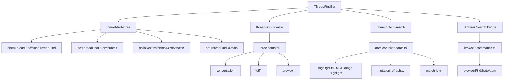

### 关键设计决策

1. **三域搜索** — 搜索在三个域之间无缝切换：conversation（对话内容）、diff（diff 变更内容）、browser（浏览器页面）。通过 `ThreadFindDomain` 类型枚举。
2. **原子状态驱动** — `thread-find-atoms.ts` 定义所有查找状态原子：开闭状态、查询字符串、激活域、匹配结果、浏览器状态等。`thread-find-store.ts` 提供纯函数式突变操作。
3. **DOM 内容搜索** — `dom-content-search/` 模块提供基于 DOM Range 的原生高亮，支持 `TreeWalker` 文本节点遍历、MutationObserver 自动刷新和 IntersectionObserver 可视区域管理。
4. **浏览器搜索桥接** — 当域切到 `browser` 时，搜索通过 `browserFindStateAtom` 桥接到内置浏览器的 Chromium find-in-page API。

---

## 6. 下载系统

### 目录结构

```
src/downloads/
├── download-formatting.ts                     # 下载格式化 (状态/错误)
├── download-popover.tsx                       # 下载弹窗
├── download-runtime.tsx                       # 下载注册表运行时
└── downloads-popover.tsx                      # 下载列表弹窗
```

### 核心抽象

下载系统基于**观察者模式**的全局注册表：

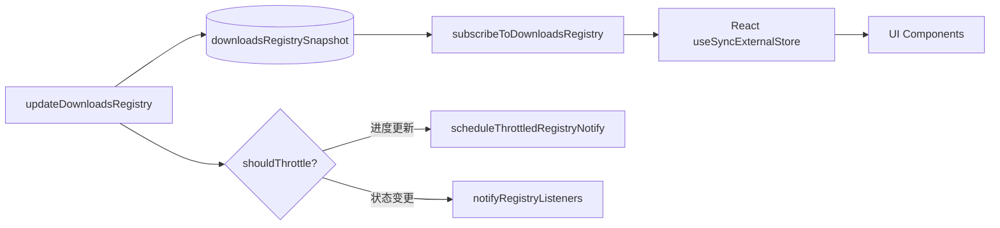

### 关键设计决策

1. **全局单例注册表** — `downloadsRegistrySnapshot` 是全局变量，通过 `updateDownloadsRegistry` 更新。支持节流（`DOWNLOAD_PROGRESS_NOTIFY_INTERVAL_MS = 500ms`），避免下载进度频繁更新导致 UI 抖动。
2. **Conversation 过滤** — `selectConversationDownloads` 按 `conversationId` 或 `browserConversationId` 过滤下载项。
3. **文件类型图标系统** — 集成 `get-file-icon` 工具，根据路径后缀名和 MIME 类型映射到 SVG 图标组件。
4. **React 外部存储订阅** — 组件通过 `useSyncExternalStore` 订阅全局注册表，不需要 React Context 或状态管理库。

---

## 7. Sites 系统

### 目录结构

```
src/sites/
├── index.tsx                                  # 入口 (导出 routes/icons/prompts)
├── prompts.ts                                 # 提示词 (启动对话/继续编辑)
├── routes.ts                                  # 路由定义
└── sites-icon.tsx                             # 图标组件
```

### 概览

Sites 系统是一个薄封装，定义路由常量：

- `SITE_SETTINGS_ROUTE = "/sites/:projectId/settings"`
- `SITES_LIBRARY_ROUTE = "/sites/library"`

`prompts.ts` 提供 `startSitesConversation` 和 `continueEditingLibraryFile` 两个提示词函数，用于启动 AppGen 系统的网站生成对话。

---

## 8. Skills 系统

### 目录结构

```
src/skills/
├── skills-apps-sidebar-new-chip.ts            # 侧边栏新标签指示器
├── skills-list-request.ts                     # Skills 列表请求
└── skills-page-loader.ts                      # Skills 页面加载器
```

### 概览

Skills 系统较薄，负责加载和管理 Codex 的 Agent Skills。`skills-list-request.ts` 处理 Skills 列表的请求逻辑（可能在后台通过 app server 获取）。`skills-page-loader.ts` 管理 Skills 页面的加载状态。`skills-apps-sidebar-new-chip.ts` 在侧边栏显示新的 Apps/Skills 指示器。

---

## 9. 自动化系统

### 目录结构

```
src/automation/                    (轻量级自动化表面)
├── automation-surface.tsx         # 自动化 Tooltip/外层组件
├── automation-route-runtime.ts    # 路由运行时
├── automation-list-cache.ts       # 自动化列表缓存
├── automation-delete-failure-message.ts  # 删除失败消息
├── heartbeat-automation-eligibility/      # 心跳自动化资格
└── automation-schedule/                   # 自动化调度

src/automations/                   (完整自动化编辑器)
├── page.tsx                       # 自动化页面入口
├── schedule.tsx                   # 自动化调度页面
├── automations-page-current.tsx   # 当前自动化页面
├── automation-side-panel/         # 侧边栏编辑器 (索引/主体/页脚/状态)
├── automation-prompt-form.tsx     # 提示词表单
├── automation-schedule-picker.tsx # 调度选择器
├── automation-heartbeat-thread-dropdown.tsx # 心跳线程下拉
├── automation-model-reasoning-dropdown.tsx  # 模型推理下拉
├── automation-execution-environment-dropdown.tsx # 执行环境下拉
├── automation-save-tooltip.tsx    # 保存提示
├── automation-citation-card-runtime.tsx     # 引用卡片
├── automation-citation-session.ts           # 引用会话
├── automation-record-sync.ts               # 记录同步
└── current-automation-*.ts                 # 当前自动化辅助
```

### 架构图

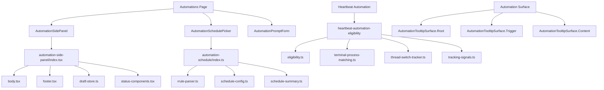

### 关键设计决策

1. **双层架构** — 系统分为 `src/automation/`（轻量级表面组件，在 composer 中显示自动化 tooltip）和 `src/automations/`（完整自动化编辑器页面）。职责分离清晰。
2. **RRule 调度** — `automation-schedule/` 使用 RFC 5545 RRule 解析器 (`rrule-parser.ts`) 处理循环调度。`schedule-config.ts` 提供 UI 友好的可读性摘要。`schedule-summary-intervals.ts` 将复杂的 RRule 转为人类可读的间隔描述。
3. **心跳自动化资格** — `heartbeat-automation-eligibility/` 决定线程是否适合创建心跳自动化。检查条件包括：终端进程匹配（`terminal-process-matching.ts`）、线程切换跟踪（`thread-switch-tracker.ts`）和心跳权限（`heartbeat-permissions.ts`）。
4. **草稿存储** — `draft-store.ts` 在侧边栏编辑器关闭后保留未保存的编辑，防止数据丢失。
5. **Tooltip 表面** — `AutomationTooltipSurface` 使用 React Context + Portal 模式，通过 `AutomationTooltipContext` 在任意位置展示自动化相关提示。

---

## 10. 工作区与 Worktree 系统

### 目录结构

```
src/workspace/                                  # 工作区文件管理
├── workspace-artifact-runtime.tsx              # 工作区产物运行时
├── workspace-file-tab-runtime.ts              # 文件 Tab 运行时
├── workspace-file-tab-descriptors-runtime.ts  # 文件 Tab 描述符
├── workspace-file-source-tabs.ts              # 文件源码 Tab
├── workspace-content-refresh-signal.ts        # 内容刷新信号
├── workspace-dependency-tools.ts              # 依赖工具检测
├── workspace-root-display-name.ts             # 根目录显示名
├── artifact-tab-navigation.ts                 # 产物 Tab 导航
├── artifact-tab-preview.tsx                   # 产物预览
├── open-artifact-tab.ts                       # 打开产物 Tab
├── select-workspace-page.tsx                  # 工作区选择页
├── select-workspace-page-helpers.ts           # 辅助函数
└── select-workspace-page-runtime.ts           # 运行时

src/worktree/                                   # Worktree/线程管理
├── new-thread-orchestrator-backing.ts          # 新线程编排器
├── new-thread-query-backing.ts                # 新线程查询
├── worktree-init-page.tsx                      # Worktree 初始化页
├── worktree-restore-runtime.ts                # Worktree 恢复
├── worktree-activity-boundary-runtime.tsx     # 活动边界
├── worktree-activity-list.tsx                 # 活动列表
├── pending-worktree-atoms.ts                  # 等待中原子状态
├── pending-worktree-conversation-ui.tsx       # 等待中 UI
├── client-local-thread-provisioning-status.ts  # 本地线程供应状态
├── host-worktree-context.ts                   # 宿主上下文
├── hotkey-window-worktree-init-page.tsx       # 热键窗口初始化
└── managed-worktree-status.ts                 # 托管状态

src/projects/                                   # 项目索引/主页
├── projects-index-page.tsx                     # 项目索引页
├── projects-index-current-app-main.tsx         # 当前应用主界面
├── projects-index-current-app-main/            # 子组件 (组件/PR/导航)
├── projects-hotkey-thread-runtime.ts           # 热键线程
├── home-project-selector-runtime.ts            # 首页项目选择器
└── project-appearance.ts                       # 项目外观设置
```

### 架构图

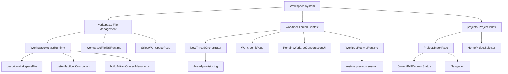

### 关键设计决策

1. **Artifact 类型系统** — `ArtifactType` 枚举定义五种类型：document、notebook、pdf、slides、spreadsheet。`describeWorkspaceFile` 根据文件路径自动识别类型，为每种类型提供图标和导入方式。
2. **Worktree 作为会话隔离** — worktree 系统管理每个线程的工作区上下文。`NewThreadOrchestrator` 负责完整的线程创建流：选择项目 → 确定分支 → 启动 worktree → 渲染线程页面。
3. **恢复机制** — `worktree-restore-runtime.ts` 在应用重启后恢复前一会话的 worktree 状态。
4. **项目索引** — `projects-index-page` 提供项目级的 CRUD 操作，包含项目状态、当前 PR 状态、项目描述等元数据。

---

## 11. 应用生成 (AppGen)

### 目录结构

```
src/appgen/
├── appgen-page.tsx                     # AppGen 页面入口
├── appgen-resource-runtime.tsx          # 资源运行时
├── appgen-sites-icon.tsx               # 站点图标
├── appgen-announcement-modal.tsx        # 公告弹窗
├── appgen-announcement-types.ts        # 公告类型
├── appgen-app-plugin-matching.ts       # 应用/插件匹配
├── appgen-publication-terms-disclosure.ts # 发布协议披露
├── artifacts.tsx                       # 应用产物
├── library-page.tsx                    # 库页面
├── library-page-current.tsx            # 当前库页面
├── library-hot-current-runtime-backing.ts     # 热门库运行时
├── library-hot-current-runtime-implementation.ts # 热门库实现
├── project-header.tsx                  # 项目头部
├── project-site-routes.ts              # 站点路由
├── analytics-page.tsx                  # 分析页
├── analytics-page-current.tsx          # 当前分析页
├── feature-announcement-modal.tsx      # 特性公告弹窗
├── settings-page.tsx                   # 设置页
├── settings-page-runtime.ts            # 设置运行时
├── settings-page-delete-dialog.tsx     # 删除确认
├── settings-page-environment-entries.tsx # 环境变量
├── settings-page-helpers.ts            # 辅助函数
├── settings-publication-runtime.tsx    # 发布设置
├── start-appgen-conversation/          # 启动生成对话
└── publication-terms/                  # 发布协议组件
```

### 概览

AppGen 是 Codex 的**网站和应用自动生成**系统。用户通过对话描述需求，系统生成完整可部署的网站/应用。核心文件在 `appgen-page.tsx` 中通过无数 runtime 兼容槽加载。

`start-appgen-conversation/` 包含启动生成对话的引导逻辑。`publication-terms/` 包含发布协议的 UI 组件（`artifact-presentation.ts`、`file-reference-actions.ts`）。`library-page*.tsx` 管理 AppGen 生成的库/模板浏览。

---

## 12. 协作系统

### 目录结构

```
src/collaboration/
├── use-workspace-users/                  # 工作区用户管理
│   ├── index.ts                          # 入口
│   ├── access-controls.tsx               # 访问控制下拉
│   ├── autocomplete.tsx                  # 用户搜索自动完成
│   ├── primary-actions.tsx               # 主要操作按钮
│   ├── queries.ts                        # 用户/组查询
│   ├── share-target-row.tsx              # 分享目标行
│   └── types.ts                          # 类型定义
├── collaboration-mode-queries.ts         # 协作模式查询
├── share-invite-autocomplete.tsx         # 分享邀请自动完成
└── use-collaboration-mode.ts             # 协作模式 Hook
```

### 架构图

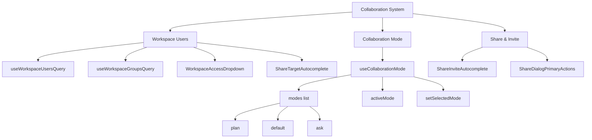

### 关键设计决策

1. **协作模式模型** — `CollaborationMode` 包含 `mode`（模式名）、`model`（LLM 模型）、`reasoning_effort`（推理强度）和 `developer_instructions`（开发者指令）。模式包括 "plan"（计划模式）、"default"（默认模式）和 "ask"（询问模式）。
2. **线程级覆盖** — 协作模式可以在对话线程上覆盖 (`threadSettings.collaborationMode`)，也可以作为草稿模式 (`draftCollaborationModeAtom`) 暂存。`useCollaborationMode` Hook 按优先级解析最终模式：显式模式 > 线程设置 > 模式列表匹配 > 回退默认。
3. **工作区用户查询** — `useWorkspaceUsersQuery` 和 `useWorkspaceGroupsQuery` 提供用户和组的搜索与缓存，支持 `filterAvailableWorkspaceUsers` 过滤和 `workspaceUserToShareTargetOption` 转换。
4. **访问控制** — `WorkspaceAccessDropdown` 和 `WorkspaceAccessSelect` 提供角色级别的访问权限选择。

---

## 13. 远程连接

### 目录结构

```
src/remote/                                     # 远程选择和控制
├── local-remote-selection/                     # 本地/远程选择器
│   ├── cloud-access.tsx                        # 云访问标签
│   ├── commands.tsx                            # 命令按钮
│   ├── index.tsx                               # 入口
│   ├── project-icon.tsx                        # 项目图标
│   ├── remote-host.ts                          # 远程主机构建
│   ├── selection-state.ts                      # 选择状态
│   └── types.ts                                # 类型定义
├── local-remote-control-enabled-sync.ts        # 控制同步
├── open-remote-project-modal.ts                # 打开远程项目弹窗
├── remote-connection-runtime.tsx               # 连接运行时
├── remote-connection-visibility.ts             # 连接可见性
├── remote-connections-page.tsx                 # 连接管理页
├── selectable-remote-connections-signal.ts     # 可选连接信号
└── use-connected-remote-connections.ts         # 已连接连接 Hook

src/remote-connections/                         # 连接管理器
├── index.ts                                    # 入口
├── local-remote-control-sync.tsx               # 控制同步
├── remote-connection-bootstrap.tsx             # 连接自举
├── remote-connection-features-runtime.ts       # 特性运行时
├── remote-connection-manager-runtime.ts        # 管理器运行时
├── remote-directory-path-input.tsx             # 目录路径输入
├── remote-host-runtime.tsx                     # 宿主运行时
├── remote-project-paths.ts                     # 项目路径
├── remote-project-setup-dialog.tsx             # 项目设置弹窗
├── remote-project-setup-runtime.ts             # 设置运行时
├── remote-ssh-analytics.ts                     # SSH 分析
├── slingshot-gate-bridge.tsx                   # Slingshot 网关桥
└── wsl-feature-bridge.tsx                      # WSL 特性桥
```

### 架构图

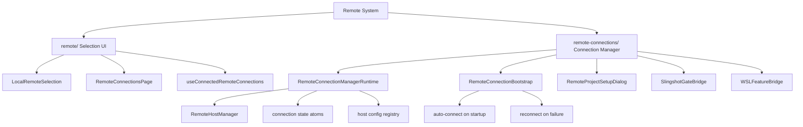

### 关键设计决策

1. **连接类型** — 支持三种远程连接：`remote_ssh_connections`（SSH）、`remote_wsl_connections`（WSL）、`remote_control_connections`（Codex 远程控制）。
2. **连接管理器** — `RemoteConnectionManagerRuntime` 维护连接注册表，使用 `currentHostIdSignal` 信号跟踪当前激活的宿主。连接状态通过 `remoteConnectionStateAtom` 原子传播。
3. **自举模式** — `RemoteConnectionBootstrap` 在应用启动时自动恢复之前的远程连接，包括 SSH 密钥验证和 WSL 环境检测。
4. **Slingshot 协议** — `SlingshotGateBridge` 实现 Codex 的专有远程连接协议，用于跨网络低延迟连接。
5. **WSL 桥** — `WSLFeatureBridge` 专门处理 WSL 环境的特性检测与集成。

---

## 14. PR 请求系统

### 目录结构

```
src/requests/
├── pending-request-item-panel.tsx              # 入口
└── pending-request-item-panel-current.tsx      # 当前实现
```

### 概览

PR 请求系统管理 Agent 向用户发出的**审批请求**（如执行命令、修改文件等需要用户确认的操作）。`PendingRequestItemPanel` 组件在对话线程中渲染待处理请求的 UI，展示请求内容、上下文和审批/拒绝按钮。

---

## 15. 代码审查系统

### 目录结构

```
src/review/
├── file-diff.tsx                              # 文件 Diff 组件
├── file-diff-runtime.ts                       # Diff 运行时
├── file-source-code-view.tsx                  # 文件源码视图
├── file-source-code-components-runtime.tsx    # 源码组件运行时
├── file-source-code-helpers-runtime.tsx       # 源码辅助
├── file-source-side-panel.tsx                 # 源码侧边栏
├── file-source-tab.tsx                        # 源码 Tab
├── file-source-options-menu.tsx               # 选项菜单
├── file-source-rich-preview.tsx               # 富文本预览
├── file-source-search-adapter.ts              # 源码搜索适配
├── file-source-header-actions.tsx             # 头部操作
├── file-source-helpers.tsx                    # 辅助函数
├── file-source-mcp-resource-view.tsx          # MCP 资源视图
├── file-path-breadcrumb.tsx                   # 路径面包屑
├── file-blame-gutter.tsx                      # Blame 信息栏
├── file-change-gutter.ts                      # 变更信息栏
├── editor-diff-page.tsx                       # 编辑器 Diff 页
├── changed-files-panel.tsx                    # 变更文件面板
├── branch-search-list.tsx                     # 分支搜索列表
├── branch-status-atoms.ts                     # 分支状态原子
├── commit-command-menu.tsx                    # 提交命令菜单
├── create-pull-request-command-menu.tsx       # 创建 PR 菜单
├── apply-review-patch.ts                      # 应用审查补丁
├── conversation-review-model.tsx              # 对话审查模型
├── conversation-review-model-runtime.ts       # 审查模型运行时
├── derive-pull-request-status.ts              # PR 状态推导
├── diff-patch-builder.ts                      # Diff 补丁构建
├── diff-column-line-number.ts                 # Diff 行号列
├── diff-find-highlight.ts                     # Diff 查找高亮
├── diff-highlighter-boundary-runtime.tsx      # Diff 高亮边界
├── diff-search-adapter.ts                     # Diff 搜索适配
├── diff-search-controller-runtime.ts          # Diff 搜索控制
├── diff-selection-summary.ts                  # 选择摘要
├── diff-virtualization-metrics.ts             # 虚拟化指标
├── git-action-availability-atoms.ts           # Git 操作可用性
├── git-action-blocked-reasons.ts              # 阻塞原因
├── git-action-blocked-reason-tooltips.tsx     # 阻塞提示
├── git-action-message-mutations.ts            # Git 操作消息
└── action-popover-primitives/                 # 操作弹出组件
```

### 关键设计决策

1. **Diff 虚拟化** — `diff-virtualization-metrics.ts` 处理大型 diff 文件的虚拟滚动，根据视口计算可见行范围。
2. **多模式 Diff 视图** — 支持内联和侧边两种 diff 渲染方式，通过 `diff-view-mode` 集成配置。
3. **Git 操作阻塞检测** — `git-action-blocked-reasons.ts` 在提交/推送前检测条件（如未设置 user.email、分支保护规则），以避免操作失败。
4. **审查模型** — `conversation-review-model.tsx` 提供 AI 驱动的代码审查，自动生成行内评论和修改建议。
5. **Diff 补丁构建** — `diff-patch-builder.ts` 将选中的 diff 区域构建为可应用的补丁，通过 `apply-review-patch.ts` 应用到工作区。

---

## 16. 新用户引导

### 目录结构

```
src/onboarding/
├── conversational-onboarding-controller.ts     # 对话式引导控制器
├── conversational-onboarding-conversation-state.ts # 对话状态
├── conversational-onboarding-analytics.ts      # 分析
├── conversational-onboarding-cancel-for-host.ts # 取消引导
├── conversational-onboarding-installing-app-status.tsx # 安装状态
├── conversational-onboarding-local-plugin-preinstall.ts # 预安装插件
├── conversational-onboarding-*.tsx             # 任务组件 (10+ 文件)
├── page/                                       # 引导页面
├── sidebar-onboarding-checklist-state.ts       # 侧边栏检查清单
├── workspace-onboarding-controller.ts          # 工作区引导
├── onboarding-plugin-suggestions/              # 插件建议
├── chronicle-setup-state/                      # Chronicle 设置
└── client-thread-scope-provider.tsx            # 客户端线程作用域
```

### 概览

引导系统通过**对话式任务序列**逐步引导新用户了解 Codex 的功能。任务包括：

- 创建 Markdown 笔记（`conversational-onboarding-desktop-note-task.tsx`）
- 发送消息（`conversational-onboarding-messaging-task.tsx`）
- 创建 CSV 图表（`conversational-onboarding-csv-chart-task.tsx`）
- 连接应用（`conversational-onboarding-app-connect-card.tsx`）
- 预约空闲时间（`conversational-onboarding-hold-next-free-hour-task.tsx`）

引导完成后，通过 `archiveConversationalOnboardingConversationsForHost` 归档引导对话。

---

## 17. 调试工具

### 目录结构

```
src/debug/
├── debug-modal.tsx                               # 弹窗入口
├── debug-modal-current.tsx                       # 当前实现
├── debug-modal-loader.tsx                        # 加载器
├── debug-panel.ts                                # 面板内容
├── debug-window-origin-effect.tsx                # 窗口来源
├── debug-window-page.tsx                         # 窗口页面
└── toggle-debug-modal-hotkey.tsx                 # 热键切换
```

### 概览

调试工具提供开发者诊断界面，通过热键（`toggle-debug-modal-hotkey.tsx`）开关。`DebugPanel` 组件展示运行时诊断信息，包括信号状态、原子值、组件树。

---

## 18. 移动端

### 目录结构

```
src/codex-mobile/
├── page.tsx                                    # 移动端页面入口
├── setup-dialog.ts                             # 设置弹窗
├── setup-dialog-current.tsx                    # 当前设置弹窗
├── setup-flow.tsx                              # 设置流程入口
└── setup-flow/
    ├── index.ts                                # 流程入口
    ├── flow.tsx                                # 流程编排
    ├── mfa.ts                                  # 多因素认证
    ├── queries.ts                              # 查询
    ├── remote-control.ts                       # 远程控制授权
    ├── status.ts                               # 状态组件
    └── types.ts                                # 类型定义
```

### 概览

移动端系统为 Codex 移动配对服务提供设置流程。核心是 `setup-flow` 子目录，包含 MFA 认证、远程控制授权和设备状态监测。用户在桌面端生成配对码，移动端通过 SSH/远程控制协议连接。

---

## 19. 应用服务

### 目录结构

```
src/app-server/
├── app-server-manager-hooks/
│   ├── index.ts                               # 入口
│   ├── config-notices.ts                      # 配置通知
│   ├── recent-conversations.ts                # 最近对话
│   ├── registry-subscriptions.ts              # 注册表订阅
│   └── registry.ts                            # 注册表
├── notification-debug-signals.ts              # 通知调试信号
└── request-handler-host-resolvers.ts          # 请求处理主机解析
```

### 概览

App Server 系统管理 Codex 后台服务（App Server）的连接和状态。`app-server-manager-hooks/` 提供 React Hooks 用于管理 App Server 配置、最近对话同步和注册表订阅。`notification-debug-signals.ts` 提供通知系统的调试信号。

---

## 20. 用户资料

### 目录结构

```
src/profile/
├── activity-metric.tsx                        # 活动指标
├── page.tsx                                   # 资料页面
└── profile-current.tsx                        # 当前资料
```

### 概览

用户资料系统展示用户的 Codex 活动数据（对话数、代码生成量等）和个人设置。`activityMetric` 在资料页面中可视化用户的使用统计。

---

## 21. 跨系统设计与模式总结

### 共享架构模式

```mermaid
flowchart TD
    subgraph "Common Patterns"
        A[Signal-based State] --> B[appScope atoms]
        A --> C[createComputedSignal]
        A --> D[useAppScopeValue/set]

        E[Runtime Init Chunks] --> F[initXxxChunk]
        F --> G[once() wrapper]
        G --> H[Lazy loading]

        I[External Store Bridge] --> J[useSyncExternalStore]
        J --> K[browser-sidebar-manager]
        J --> L[downloads-registry]

        M[Host Communication] --> N[App Server Mutations]
        M --> O[VSCode API Messages]
        M --> P[Host Request]

        Q[Feature Gates] --> R[useFeatureGate]
        R --> S["1834314516" etc.]
    end
```

### 核心模式

1. **原子信号驱动状态** — 所有系统都使用 `appScope` 原子（来自 `@/boundaries/app-scope`）管理响应式状态。`createComputedSignal` 创建派生信号，自动追踪依赖树。这与 Jotai 的信号模型兼容。

2. **Chunk 初始化模式** — 每个子系统暴露 `initXxxChunk()` 函数，内部调用子模块的初始化函数。通过 `once()` 包装保证每个 chunk 只执行一次，实现惰性加载和代码分割。

3. **外部存储同步** — `useSyncExternalStore` 是连接非 React 状态（如下载注册表、浏览器管理器）与 React 渲染的关键模式。这避免了额外的 Context 层。

4. **宿主通信桥** — 应用通过三种方式与宿主通信：
   - **App Server Mutations**: `useAppServerMutation`（Git 操作、线程设置等）
   - **VSCode API**: `vscodeApiF.dispatchMessage`（浏览器命令、侧边栏同步等）
   - **Host Request**: `sendHostRequest`（文件操作、远程连接等）

5. **功能门控** — 使用 `useFeatureGate`（参数为字符串 ID，如 `"1834314516"`）控制特性的渐进式发布。返回布尔值控制 UI 渲染和功能启用。

6. **代码恢复标记** — 所有反编译文件头部标记 `// Restored from ref/webview/assets/` 指向原始 webview bundle 文件，便于追踪来源。

### 系统间依赖图

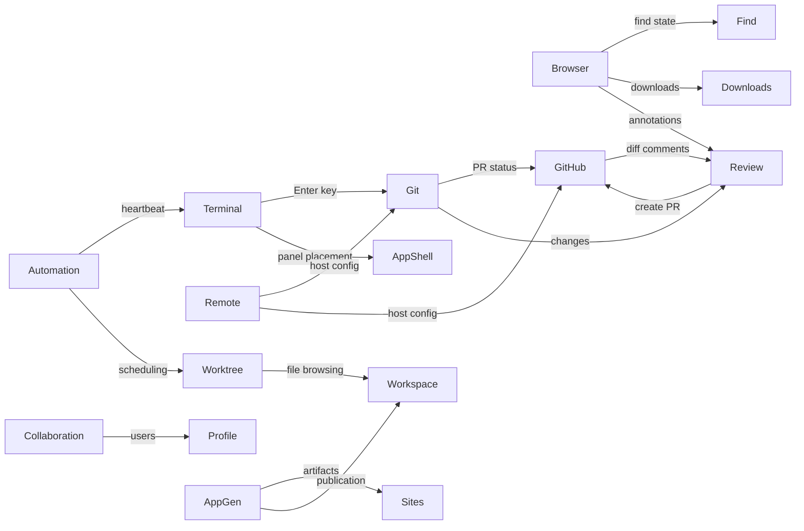

### 文件命名约定

系统文件命名使用一致的约定：

| 后缀 | 含义 |
|------|------|
| `*.ts` | 无 JSX 的纯逻辑、类型、工具函数 |
| `*.tsx` | 含 JSX 的 React 组件 |
| `*-runtime.ts` | 运行时初始化、effect 编排 |
| `*-runtime.tsx` | 含 JSX 的运行时组件 |
| `*-signals.ts` | 信号/原子定义 |
| `*-store.ts` | 状态存储操作函数 |
| `*-queries.ts` | React Query hooks |
| `*-mutations.ts` | React Query mutations |
| `*-model.ts` | 数据模型/类型 |
| `*-utils.ts` / `*-helpers.ts` | 工具函数 |
| `*-parts/` | 子组件目录 |
